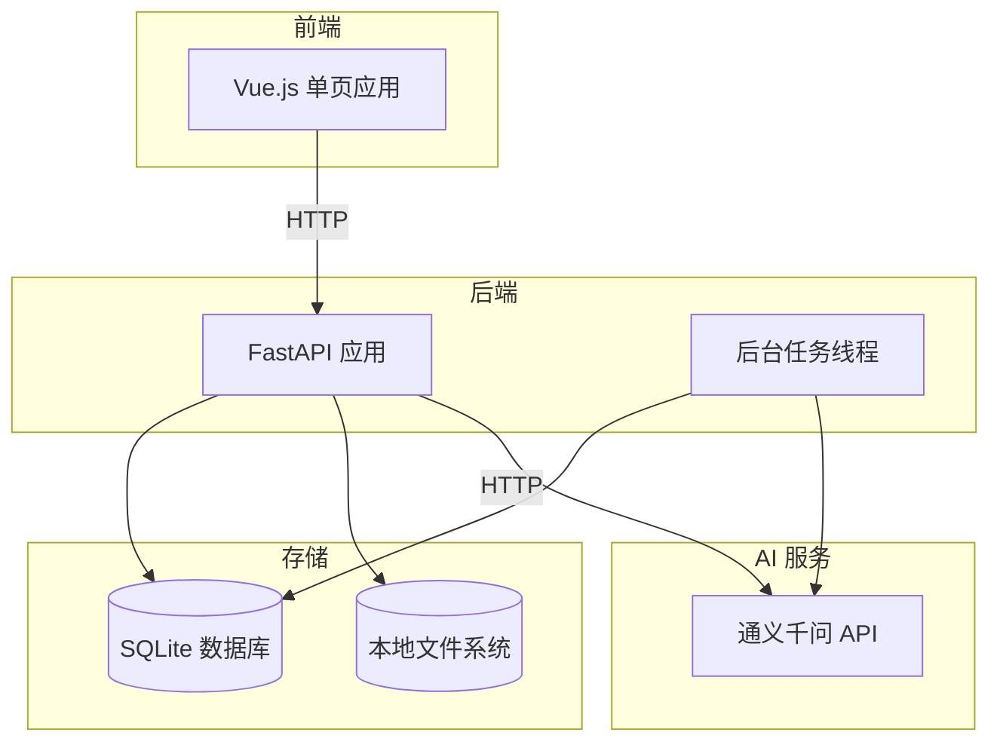
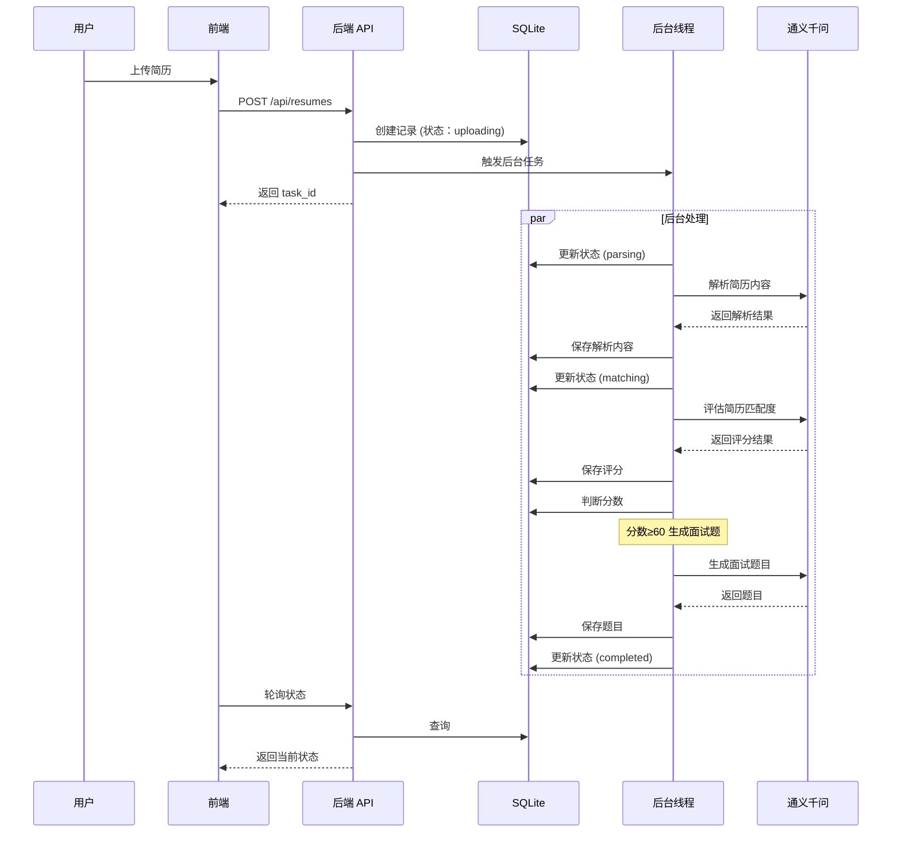

# 人力资源招聘智能辅助工具 - 技术设计方案 (MVP 版本)

需求名称：hr-recruitment-assistant
更新日期：2026-04-21

## 1. 概述

### 1.1 需求背景

本系统设计一个人力资源招聘智能辅助工具，帮助企业 HR 高效处理大量简历筛选工作。**MVP 版本优先保证本地最小可运行**，核心实现：
- 多岗位 JD（职位描述）管理和评分规则配置
- 多格式简历批量上传和智能解析
- 基于 AI 的简历自动评分和筛选
- 自动生成针对性面试题目和参考答案

### 1.2 设计目标

1. **简单部署**：单机运行，无需复杂基础设施
2. **最小依赖**：SQLite 数据库，无 Redis/K8s 等
3. **核心功能**：优先实现核心筛选和生成功能
4. **快速验证**：支持本地开发测试，快速迭代

### 1.3 技术选型

| 层级 | 技术栈 | 说明 |
|------|--------|------|
| 前端 | Vue 3 + Vite | 轻量级前端 |
| UI 组件库 | Element Plus | 开箱即用 |
| 后端 | Python 3.10+ | 快速开发 |
| Web 框架 | FastAPI | 简单高性能 |
| 数据库 | SQLite 3 | 零配置 |
| ORM | SQLAlchemy 2.0 | 异步支持 |
| AI 服务 | 通义千问 API | 文本理解和生成 |
| 文档解析 | python-docx, PyPDF2 | 本地解析 |
| 部署 | 单机运行 | docker-compose（可选） |

## 2. 架构

### 2.1 简化架构图



### 2.2 简化技术栈

```
项目结构：
hr-recruitment-mvp/
├── backend/
│   ├── app/
│   │   ├── main.py           # FastAPI 入口
│   │   ├── database.py       # SQLite 配置
│   │   ├── models.py         # 数据模型
│   │   ├── schemas.py        # Pydantic Schema
│   │   ├── api.py            # API 路由
│   │   ├── services.py       # 业务逻辑
│   │   ├── tasks.py          # 后台任务
│   │   ├── ai_client.py      # AI 服务客户端
│   │   └── parser.py         # 文档解析
│   ├── requirements.txt
│   └── hr.db                 # SQLite 数据库文件
├── frontend/
│   ├── src/
│   │   ├── App.vue
│   │   ├── main.ts
│   │   ├── views/
│   │   ├── components/
│   │   ├── api/
│   │   └── stores/
│   ├── package.json
│   └── vite.config.ts
├── uploads/                    # 上传文件存储
│   ├── jobs/
│   └── resumes/
└── docker-compose.yml         # 可选部署
```

### 2.3 任务处理流程（简化版）



## 3. 组件与接口

### 3.1 后端设计

#### 3.1.1 SQLite 数据库配置

```python
# backend/app/database.py
from sqlalchemy import create_engine
from sqlalchemy.ext.declarative import declarative_base
from sqlalchemy.orm import sessionmaker
from pathlib import Path

BASE_DIR = Path(__file__).resolve().parent.parent
DATABASE_URL = f"sqlite+aiosqlite:///{BASE_DIR}/hr.db"

# SQLite 引擎（单线程模式）
engine = create_engine(
    DATABASE_URL.replace("sqlite+aiosqlite", "sqlite"),
    connect_args={"check_same_thread": False},
    pool_pre_ping=True
)

SessionLocal = sessionmaker(autocommit=False, autoflush=False, bind=engine)
Base = declarative_base()

def get_db():
    db = SessionLocal()
    try:
        yield db
    finally:
        db.close()
```

#### 3.1.2 数据模型（简化版）

```python
# backend/app/models.py
from sqlalchemy import Column, String, Integer, Float, Text, ForeignKey, DateTime, JSON, Boolean
from sqlalchemy.orm import relationship
from datetime import datetime
import uuid

from .database import Base

def generate_uuid():
    return str(uuid.uuid4())

class JobPosting(Base):
    __tablename__ = "job_postings"
    
    id = Column(String, primary_key=True, default=generate_uuid)
    title = Column(String(200), nullable=False)
    department = Column(String(100))
    jd_content = Column(Text, nullable=False)
    jd_file_path = Column(String(500))  # 本地文件路径
    status = Column(String(20), default='active')
    score_rules = Column(JSON, default=list)  # 简化为 JSON 存储
    created_at = Column(DateTime, default=datetime.now)
    updated_at = Column(DateTime, default=datetime.now, onupdate=datetime.now)
    
    resumes = relationship("Resume", back_populates="job", cascade="all, delete-orphan")

class Resume(Base):
    __tablename__ = "resumes"
    
    id = Column(String, primary_key=True, default=generate_uuid)
    job_id = Column(String, ForeignKey('job_postings.id'), nullable=False)
    candidate_name = Column(String(100))
    file_path = Column(String(500), nullable=False)  # 本地文件路径
    file_type = Column(String(20))
    file_size = Column(Integer)
    parsed_content = Column(JSON)  # 解析后的内容
    status = Column(String(50), default='uploading')
    status_progress = Column(Integer, default=0)
    status_message = Column(Text)
    error_message = Column(Text)
    created_at = Column(DateTime, default=datetime.now)
    updated_at = Column(DateTime, default=datetime.now, onupdate=datetime.now)
    
    job = relationship("JobPosting", back_populates="resumes")
    matching_result = relationship("MatchingResult", back_populates="resume", uselist=False, cascade="all, delete-orphan")
    interview_questions = relationship("InterviewQuestion", back_populates="resume", cascade="all, delete-orphan")

class MatchingResult(Base):
    __tablename__ = "matching_results"
    
    id = Column(String, primary_key=True, default=generate_uuid)
    resume_id = Column(String, ForeignKey('resumes.id'), unique=True, nullable=False)
    total_score = Column(Float, nullable=False)
    recommendation = Column(String(50))  # highly_recommended/recommended/not_recommended
    summary = Column(Text)
    analysis_report = Column(Text)
    dimension_scores = Column(JSON)  # 维度评分 [{dimension, score, max_score, evidence}]
    created_at = Column(DateTime, default=datetime.now)
    
    resume = relationship("Resume", back_populates="matching_result")

class InterviewQuestion(Base):
    __tablename__ = "interview_questions"
    
    id = Column(String, primary_key=True, default=generate_uuid)
    resume_id = Column(String, ForeignKey('resumes.id'), nullable=False)
    question = Column(Text, nullable=False)
    answer = Column(Text, nullable=False)
    category = Column(String(50))  # technical/behavioral/cultural_fit
    difficulty = Column(String(20))  # easy/medium/hard
    sort_order = Column(Integer, default=0)
    created_at = Column(DateTime, default=datetime.now)
    
    resume = relationship("Resume", back_populates="interview_questions")
```

#### 3.1.3 API 接口（核心精简版）

```python
# backend/app/api.py
from fastapi import APIRouter, Depends, UploadFile, File, Form, HTTPException
from sqlalchemy.orm import Session
from typing import List
from . import models, schemas, services, tasks
from .database import get_db
from pathlib import Path
import shutil

router = APIRouter()
UPLOAD_DIR = Path(__file__).parent.parent / "uploads"
UPLOAD_DIR.mkdir(exist_ok=True)

# ========== 岗位管理 ==========
@router.post("/jobs/", response_model=schemas.JobSchema)
async def create_job(job: schemas.JobCreate, db: Session = Depends(get_db)):
    """创建岗位"""
    return await services.create_job(db, job)

@router.get("/jobs/", response_model=List[schemas.JobSchema])
async def list_jobs(db: Session = Depends(get_db)):
    """岗位列表"""
    return await services.get_all_jobs(db)

@router.get("/jobs/{job_id}", response_model=schemas.JobDetailSchema)
async def get_job(job_id: str, db: Session = Depends(get_db)):
    """岗位详情"""
    job = await services.get_job(db, job_id)
    if not job:
        raise HTTPException(404, "岗位不存在")
    return job

@router.post("/jobs/{job_id}/score-rules")
async def set_score_rules(job_id: str, rules: schemas.ScoreRules, db: Session = Depends(get_db)):
    """配置评分规则"""
    return await services.update_score_rules(db, job_id, rules)

# ========== 简历上传 ==========
@router.post("/resumes/upload", response_model=schemas.UploadResponse)
async def upload_resumes(
    job_id: str = Form(...),
    files: List[UploadFile] = File(...),
    db: Session = Depends(get_db)
):
    """批量上传简历"""
    task_ids = []
    
    for file in files:
        # 保存文件
        file_ext = Path(file.filename).suffix.lower()
        file_path = UPLOAD_DIR / "resumes" / f"{uuid.uuid4()}{file_ext}"
        file_path.parent.mkdir(exist_ok=True)
        
        with open(file_path, "wb") as buffer:
            shutil.copyfileobj(file.file, buffer)
        
        # 创建数据库记录
        resume = await services.create_resume(db, job_id, file_path, file.content_type, file.size)
        task_ids.append(resume.id)
        
        # 触发后台处理任务
        tasks.process_resume.delay(resume_id=resume.id)
    
    return schemas.UploadResponse(task_ids=task_ids)

@router.get("/resumes/", response_model=List[schemas.ResumeSchema])
async def list_resumes(job_id: str, db: Session = Depends(get_db)):
    """简历列表"""
    return await services.get_resumes_by_job(db, job_id)

@router.get("/resumes/{resume_id}", response_model=schemas.ResumeDetailSchema)
async def get_resume(resume_id: str, db: Session = Depends(get_db)):
    """简历详情"""
    resume = await services.get_resume(db, resume_id)
    if not resume:
        raise HTTPException(404, "简历不存在")
    return resume

@router.get("/resumes/{resume_id}/status")
async def get_resume_status(resume_id: str, db: Session = Depends(get_db)):
    """轮询简历处理状态"""
    resume = await services.get_resume(db, resume_id)
    if not resume:
        raise HTTPException(404, "简历不存在")
    
    return {
        "id": resume.id,
        "status": resume.status,
        "progress": resume.status_progress,
        "message": resume.status_message,
        "error": resume.error_message
    }

# ========== 匹配结果 ==========
@router.get("/matching/results/{job_id}")
async def get_matching_results(job_id: str, min_score: float = 0, db: Session = Depends(get_db)):
    """获取岗位下的匹配结果"""
    return await services.get_matching_results(db, job_id, min_score)

@router.get("/matching/results/{resume_id}/detail")
async def get_matching_detail(resume_id: str, db: Session = Depends(get_db)):
    """获取单份简历的评分详情"""
    result = await services.get_matching_result(db, resume_id)
    if not result:
        raise HTTPException(404, "未找到匹配结果")
    return result

@router.get("/matching/results/{resume_id}/report")
async def get_analysis_report(resume_id: str, db: Session = Depends(get_db)):
    """获取分析报告"""
    report = await services.get_analysis_report(db, resume_id)
    if not report:
        raise HTTPException(404, "未找到报告")
    return report

# ========== 面试题目 ==========
@router.get("/interviews/questions/{resume_id}")
async def get_interview_questions(resume_id: str, db: Session = Depends(get_db)):
    """获取面试题目"""
    return await services.get_interview_questions(db, resume_id)

@router.get("/interviews/questions/{resume_id}/export")
async def export_questions(resume_id: str, format: str = "txt", db: Session = Depends(get_db)):
    """导出面试题目"""
    return await services.export_questions(db, resume_id, format)
```

#### 3.1.4 后台任务（简化为线程池）

```python
# backend/app/tasks.py
import threading
import logging
from typing import Optional
from .database import SessionLocal
from . import models, services
from .ai_client import AIClient
from .parser import DocumentParser

logger = logging.getLogger(__name__)

class SimpleTaskQueue:
    """简单的任务队列（线程池）"""
    
    def __init__(self, max_workers: int = 3):
        self.max_workers = max_workers
        self.semaphore = threading.Semaphore(max_workers)
    
    def submit(self, func, **kwargs):
        """提交任务"""
        def worker():
            try:
                with self.semaphore:
                    func(**kwargs)
            finally:
                pass
        
        thread = threading.Thread(target=worker)
        thread.daemon = True
        thread.start()
        return thread

task_queue = SimpleTaskQueue(max_workers=3)

def process_resume(resume_id: str):
    """处理简历（包含两阶段任务）"""
    db = SessionLocal()
    try:
        resume = db.query(models.Resume).get(resume_id)
        if not resume:
            logger.error(f"简历不存在：{resume_id}")
            return
        
        update_status(db, resume, "parsing", 10, "开始解析简历...")
        
        # ========== 阶段 1：文档解析 ==========
        try:
            parsed_content = DocumentParser.parse(resume.file_path)
            update_status(db, resume, "parsed", 30, "解析完成", parsed_content=parsed_content)
        except Exception as e:
            logger.error(f"解析失败：{e}")
            update_status(db, resume, "failed", 0, f"解析失败：{str(e)}")
            return
        
        # ========== 阶段 2：JD 匹配评分 ==========
        update_status(db, resume, "matching", 40, "开始匹配 JD...")
        
        job = db.query(models.JobPosting).get(resume.job_id)
        if not job:
            update_status(db, resume, "failed", 0, "关联岗位不存在")
            return
        
        try:
            ai_client = AIClient()
            
            # 调用 AI 评估
            matching_result = ai_client.evaluate_resume(
                jd_content=job.jd_content,
                score_rules=job.score_rules,
                resume_content=parsed_content
            )
            
            # 保存结果
            services.save_matching_result(db, resume.id, matching_result)
            
            if matching_result["total_score"] >= 60:
                update_status(db, resume, "matched", 70, f"匹配通过 ({matching_result['total_score']}分)")
                
                # ========== 阶段 3：生成面试题目 ==========
                update_status(db, resume, "generating_questions", 80, "生成面试题目...")
                
                questions = ai_client.generate_interview_questions(
                    jd_content=job.jd_content,
                    resume_content=parsed_content,
                    matching_result=matching_result,
                    count=15
                )
                
                services.save_interview_questions(db, resume.id, questions)
                update_status(db, resume, "completed", 100, "处理完成")
                
            else:
                update_status(db, resume, "completed", 100, f"匹配未通过 ({matching_result['total_score']}分)")
                
        except Exception as e:
            logger.error(f"AI 处理失败：{e}")
            update_status(db, resume, "failed", 0, f"AI 处理失败：{str(e)}")
            
    except Exception as e:
        logger.error(f"任务执行失败：{e}")
        update_status(db, resume, "failed", 0, f"系统错误：{str(e)}")
    finally:
        db.close()

def update_status(db, resume: models.Resume, status: str, progress: int, message: str = None, **kwargs):
    """更新简历状态"""
    resume.status = status
    resume.status_progress = progress
    if message:
        resume.status_message = message
    for key, value in kwargs.items():
        if hasattr(resume, key):
            setattr(resume, key, value)
    
    # 状态时间戳
    if status == "parsed":
        resume.parsed_at = datetime.now()
    elif status == "matched":
        resume.matched_at = datetime.now()
    elif status == "completed":
        resume.completed_at = datetime.now()
    
    db.commit()
    db.refresh(resume)
```

### 3.2 AI 服务集成（简化版）

```python
# backend/app/ai_client.py
import dashscope
import json
import os
from typing import Dict, List, Any

class AIClient:
    def __init__(self):
        self.api_key = os.getenv("DASHSCOPE_API_KEY")
        if not self.api_key:
            raise ValueError("DASHSCOPE_API_KEY 环境变量未设置")
        dashscope.api_key = self.api_key
        self.model = "qwen-max"
    
    def evaluate_resume(self, jd_content: str, score_rules: List[Dict], resume_content: Dict) -> Dict:
        """简历评估评分"""
        
        prompt = f"""
你是专业的招聘专家。请根据以下岗位 JD 和评分规则，对候选人简历进行评估打分。

## 岗位 JD
{jd_content}

## 评分规则
{json.dumps(score_rules, ensure_ascii=False, indent=2)}

## 候选人简历
{json.dumps(resume_content, ensure_ascii=False, indent=2)}

请按照以下格式返回评估结果（必须是有效的 JSON）：
{{
    "total_score": 85,
    "recommendation": "recommended",
    "summary": "简要总结",
    "analysis_report": "详细分析报告",
    "dimension_scores": [
        {{
            "dimension": "学历",
            "score": 25,
            "max_score": 30,
            "evidence": ["硕士学历，计算机专业"]
        }}
    ]
}}

recommendation 可选值：
- highly_recommended: 强烈推荐（总分≥85）
- recommended: 推荐（60≤总分<85）
- not_recommended: 不推荐（总分<60）

请直接返回 JSON，不要有其他文字。"""
        
        try:
            response = dashscope.Generation.call(
                model=self.model,
                prompt=prompt,
                result_format='text'
            )
            
            if response.status_code == 200:
                result_text = response.output.text
                # 提取 JSON 部分
                start = result_text.find('{')
                end = result_text.rfind('}') + 1
                if start >= 0 and end > start:
                    json_str = result_text[start:end]
                    return json.loads(json_str)
                raise ValueError("AI 返回格式错误")
            else:
                raise Exception(f"AI 调用失败：{response.code}")
                
        except Exception as e:
            raise Exception(f"简历评估失败：{str(e)}")
    
    def generate_interview_questions(self, jd_content: str, resume_content: Dict, matching_result: Dict, count: int = 15) -> List[Dict]:
        """生成面试题目"""
        
        prompt = f"""
你是面试官。请根据以下 JD、简历和评估结果，生成针对性的面试题目。

## 岗位 JD
{jd_content}

## 候选人简历
{json.dumps(resume_content, ensure_ascii=False, indent=2)}

## 评估结果
总分：{matching_result.get('total_score')}
评价：{matching_result.get('summary')}

请生成 {count} 个面试问题，包含：
- 技术能力题（40%）
- 行为面试题（30%）
- 文化匹配题（20%）
- 解决问题题（10%）

按照以下格式返回（必须是有效的 JSON 数组）：
[
    {{
        "question": "请介绍一下你在 XX 项目中的角色",
        "answer": "参考答案要点...",
        "category": "technical",
        "difficulty": "medium"
    }}
]

category 可选：technical, behavioral, cultural_fit, problem_solving
difficulty 可选：easy, medium, hard

请直接返回 JSON 数组，不要有其他文字。"""
        
        try:
            response = dashscope.Generation.call(
                model=self.model,
                prompt=prompt,
                result_format='text'
            )
            
            if response.status_code == 200:
                result_text = response.output.text
                # 提取 JSON 数组
                start = result_text.find('[')
                end = result_text.rfind(']') + 1
                if start >= 0 and end > start:
                    json_str = result_text[start:end]
                    return json.loads(json_str)
                raise ValueError("AI 返回格式错误")
            else:
                raise Exception(f"AI 调用失败：{response.code}")
                
        except Exception as e:
            raise Exception(f"面试题生成失败：{str(e)}")
```

### 3.3 文档解析工具

```python
# backend/app/parser.py
from pathlib import Path
from typing import Dict, Any
import json

class DocumentParser:
    """文档解析器"""
    
    @staticmethod
    def parse(file_path: str) -> Dict[str, Any]:
        """解析文档，返回结构化内容"""
        file_ext = Path(file_path).suffix.lower()
        
        if file_ext in ['.pdf']:
            return DocumentParser._parse_pdf(file_path)
        elif file_ext in ['.docx', '.doc']:
            return DocumentParser._parse_docx(file_path)
        elif file_ext in ['.txt', '.md']:
            return DocumentParser._parse_text(file_path)
        else:
            raise ValueError(f"不支持的文件类型：{file_ext}")
    
    @staticmethod
    def _parse_pdf(file_path: str) -> Dict:
        """解析 PDF"""
        try:
            import PyPDF2
            text = ""
            with open(file_path, 'rb') as f:
                reader = PyPDF2.PdfReader(f)
                for page in reader.pages:
                    text += page.extract_text()
            return {"raw_text": text, "file_type": "pdf"}
        except ImportError:
            raise ImportError("请安装 PyPDF2：pip install PyPDF2")
    
    @staticmethod
    def _parse_docx(file_path: str) -> Dict:
        """解析 Word"""
        try:
            from docx import Document
            doc = Document(file_path)
            text = "\n".join([para.text for para in doc.paragraphs])
            return {"raw_text": text, "file_type": "docx"}
        except ImportError:
            raise ImportError("请安装 python-docx：pip install python-docx")
    
    @staticmethod
    def _parse_text(file_path: str) -> Dict:
        """解析 TXT/MD"""
        with open(file_path, 'r', encoding='utf-8') as f:
            text = f.read()
        return {"raw_text": text, "file_type": "text"}
```

### 3.4 前端简化设计

#### 3.4.1 核心页面

```
frontend/src/views/
├── Home.vue              # 首页（岗位列表）
├── JobDetail.vue         # 岗位详情
├── ResumeList.vue        # 简历列表
├── ResumeUpload.vue      # 上传简历
├── MatchingResult.vue    # 筛选结果
├── ScoreDetail.vue       # 评分详情
└── InterviewQuestions.vue # 面试题目
```

#### 3.4.2 API 调用封装

```typescript
// frontend/src/api/index.ts
import axios from 'axios'

const api = axios.create({
  baseURL: '/api',
  timeout: 30000
})

export const jobApi = {
  createJob: (data: any) => api.post('/jobs/', data),
  listJobs: () => api.get('/jobs/'),
  getJob: (id: string) => api.get(`/jobs/${id}`),
  setScoreRules: (jobId: string, rules: any) => api.post(`/jobs/${jobId}/score-rules`, rules)
}

export const resumeApi = {
  uploadResumes: (jobId: string, files: File[]) => {
    const formData = new FormData()
    formData.append('job_id', jobId)
    files.forEach(file => formData.append('files', file))
    return api.post('/resumes/upload', formData)
  },
  listResumes: (jobId: string) => api.get(`/resumes?job_id=${jobId}`),
  getResumeStatus: (resumeId: string) => api.get(`/resumes/${resumeId}/status`),
  pollStatus: async (resumeId: string): Promise<any> => {
    const poll = () => new Promise((resolve, reject) => {
      const check = async () => {
        try {
          const res = await resumeApi.getResumeStatus(resumeId)
          if (res.data.status === 'completed' || res.data.status === 'failed') {
            resolve(res.data)
          } else {
            setTimeout(check, 2000)
          }
        } catch (e) {
          reject(e)
        }
      }
      check()
    })
    return poll()
  }
}

export const matchingApi = {
  getResults: (jobId: string) => api.get(`/matching/results/${jobId}`),
  getDetail: (resumeId: string) => api.get(`/matching/results/${resumeId}/detail`),
  getReport: (resumeId: string) => api.get(`/matching/results/${resumeId}/report`)
}

export const interviewApi = {
  getQuestions: (resumeId: string) => api.get(`/interviews/questions/${resumeId}`),
  exportQuestions: (resumeId: string, format: string) => 
    api.get(`/interviews/questions/${resumeId}/export?format=${format}`)
}
```

## 4. 数据模型

### 4.1 SQLite 表结构

```sql
-- 岗位表
CREATE TABLE job_postings (
    id VARCHAR(36) PRIMARY KEY,
    title VARCHAR(200) NOT NULL,
    department VARCHAR(100),
    jd_content TEXT NOT NULL,
    jd_file_path VARCHAR(500),
    status VARCHAR(20) DEFAULT 'active',
    score_rules JSON,
    created_at DATETIME DEFAULT CURRENT_TIMESTAMP,
    updated_at DATETIME DEFAULT CURRENT_TIMESTAMP
);

-- 简历表
CREATE TABLE resumes (
    id VARCHAR(36) PRIMARY KEY,
    job_id VARCHAR(36) NOT NULL,
    candidate_name VARCHAR(100),
    file_path VARCHAR(500) NOT NULL,
    file_type VARCHAR(20),
    file_size INTEGER,
    parsed_content JSON,
    status VARCHAR(50) DEFAULT 'uploading',
    status_progress INTEGER DEFAULT 0,
    status_message TEXT,
    error_message TEXT,
    created_at DATETIME DEFAULT CURRENT_TIMESTAMP,
    updated_at DATETIME DEFAULT CURRENT_TIMESTAMP,
    FOREIGN KEY (job_id) REFERENCES job_postings(id) ON DELETE CASCADE
);

-- 匹配结果表
CREATE TABLE matching_results (
    id VARCHAR(36) PRIMARY KEY,
    resume_id VARCHAR(36) UNIQUE NOT NULL,
    total_score REAL NOT NULL,
    recommendation VARCHAR(50),
    summary TEXT,
    analysis_report TEXT,
    dimension_scores JSON,
    created_at DATETIME DEFAULT CURRENT_TIMESTAMP,
    FOREIGN KEY (resume_id) REFERENCES resumes(id) ON DELETE CASCADE
);

-- 面试题目表
CREATE TABLE interview_questions (
    id VARCHAR(36) PRIMARY KEY,
    resume_id VARCHAR(36) NOT NULL,
    question TEXT NOT NULL,
    answer TEXT NOT NULL,
    category VARCHAR(50),
    difficulty VARCHAR(20),
    sort_order INTEGER DEFAULT 0,
    created_at DATETIME DEFAULT CURRENT_TIMESTAMP,
    FOREIGN KEY (resume_id) REFERENCES resumes(id) ON DELETE CASCADE
);

-- 索引
CREATE INDEX idx_resumes_job_id ON resumes(job_id);
CREATE INDEX idx_resumes_status ON resumes(status);
CREATE INDEX idx_interview_questions_resume_id ON interview_questions(resume_id);
```

## 5. 正确性属性

### 5.1 核心保证

1. **数据持久化**
   - SQLite 事务确保数据一致性
   - 文件上传后立即保存数据库记录
   - 状态更新原子操作

2. **任务可靠性**
   - 后台线程处理，主 API 不阻塞
   - 失败任务记录错误信息
   - 支持手动重试

3. **并发控制**
   - SQLite 单写多读限制
   - 任务队列限制并发数（3 个）
   - 避免数据库锁死

### 5.2 错误处理

```python
# backend/app/core/exceptions.py
class AppException(Exception):
    def __init__(self, message: str, status_code: int = 500):
        self.message = message
        self.status_code = status_code

class NotFoundException(AppException):
    def __init__(self, resource: str):
        super().__init__(f"{resource} 不存在", 404)

class AIServiceException(AppException):
    def __init__(self, message: str):
        super().__init__(f"AI 服务错误：{message}", 503)

class ParseException(AppException):
    def __init__(self, message: str):
        super().__init__(f"文档解析失败：{message}", 500)

# FastAPI 异常处理
@app.exception_handler(AppException)
async def app_exception_handler(request: Request, exc: AppException):
    return JSONResponse(
        status_code=exc.status_code,
        content={"error": True, "message": exc.message}
    )
```

## 6. 测试策略

### 6.1 最小测试集

```python
# tests/test_api.py
import pytest
from fastapi.testclient import TestClient
from app.main import app

client = TestClient(app)

def test_create_job():
    response = client.post("/api/jobs/", json={
        "title": "Python 工程师",
        "jd_content": "要求 3 年以上经验"
    })
    assert response.status_code == 200
    assert "id" in response.json()

def test_upload_resume(tmp_path):
    # 创建岗位
    job_resp = client.post("/api/jobs/", json={
        "title": "测试岗位",
        "jd_content": "测试 JD"
    })
    job_id = job_resp.json()["id"]
    
    # 创建测试文件
    test_file = tmp_path / "test_resume.txt"
    test_file.write_text("张三，5 年 Python 经验")
    
    # 上传
    with open(test_file, "rb") as f:
        response = client.post(
            "/api/resumes/upload",
            files={"files": ("test.txt", f, "text/plain")},
            data={"job_id": job_id}
        )
    
    assert response.status_code == 200
    assert "task_ids" in response.json()

def test_poll_status():
    # 等待后台处理完成
    import time
    time.sleep(5)
    
    response = client.get(f"/api/resumes/{resume_id}/status")
    assert response.json()["status"] in ["completed", "failed"]
```

### 6.2 手动测试清单

- [ ] 创建岗位成功
- [ ] 配置评分规则成功
- [ ] 上传 TXT/PDF/Word简历
- [ ] 状态轮询正常
- [ ] 查看评分详情
- [ ] 查看分析报告
- [ ] 查看面试题目
- [ ] 导出面试题目

## 7. 部署指南

### 7.1 本地运行

```bash
# 1. 克隆项目
git clone <repo>
cd hr-recruitment-mvp

# 2. 安装后端依赖
cd backend
pip install -r requirements.txt

# 3. 设置环境变量
export DASHSCOPE_API_KEY="your-api-key"

# 4. 启动后端
uvicorn app.main:app --reload --host 0.0.0.0 --port 8000

# 5. 安装前端依赖
cd ../frontend
npm install

# 6. 启动前端
npm run dev

# 7. 访问 http://localhost:5173 (Vite)
```

### 7.2 Docker Compose（可选）

```yaml
# docker-compose.yml
version: '3.8'

services:
  backend:
    build: ./backend
    ports:
      - "8000:8000"
    environment:
      - DASHSCOPE_API_KEY=${DASHSCOPE_API_KEY}
    volumes:
      - ./backend/app:/app/app
      - ./uploads:/app/uploads
      - ./hr.db:/app/hr.db
    command: uvicorn app.main:app --host 0.0.0.0 --port 8000 --reload
  
  frontend:
    build: ./frontend
    ports:
      - "5173:5173"
    volumes:
      - ./frontend/src:/app/src
    command: npm run dev -- --host 0.0.0.0
```

### 7.3 requirements.txt

```
fastapi==0.104.1
uvicorn==0.24.0
python-multipart==0.0.6
sqlalchemy==2.0.23
aiosqlite==0.19.0
pydantic==2.5.0
python-docx==1.1.0
PyPDF2==3.0.1
dashscope==1.13.6
```

## 8. 项目计划（MVP）

| 周次 | 任务 | 交付物 |
|------|------|--------|
| 第 1 周 | 项目初始化、数据库设计、岗位管理模块 | 可创建岗位 |
| 第 2 周 | 文件上传、简历解析 | 可上传解析简历 |
| 第 3 周 | AI 集成、评分功能 | 可查看评分 |
| 第 4 周 | 面试题生成、前端界面 | 完整 MVP 上线 |

---

## 引用链接

[^1]: [FastAPI 官方文档](https://fastapi.tiangolo.com/)
[^2]: [Vue 3 官方文档](https://vuejs.org/)
[^3]: [SQLAlchemy 文档](https://docs.sqlalchemy.org/)
[^4]: [通义千问 API 文档](https://help.aliyun.com/zh/dashscope/)
