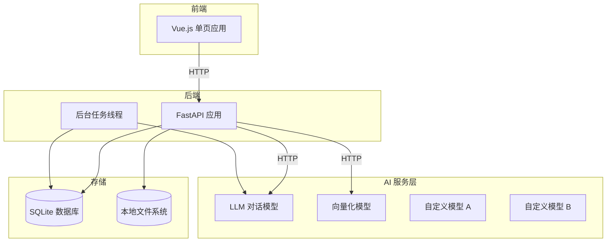

# 人力资源招聘智能辅助工具 - 技术设计方案 (MVP 版本 v2)

需求名称：hr-recruitment-assistant
更新日期：2026-04-21
版本：v2.0

## 1. 概述

### 1.1 需求背景

本系统设计一个人力资源招聘智能辅助工具，帮助企业 HR 高效处理大量简历筛选工作。**MVP 版本优先保证本地最小可运行**，核心实现：
- 多岗位 JD（职位描述）管理和评分规则配置
- 多格式简历批量上传和智能解析（MarkItDown 统一解析）
- 基于 AI 的简历自动评分和筛选
- 自动生成针对性面试题目和参考答案
- **企业人才库建设**（新增）
- **大模型服务自定义配置**（新增）

### 1.2 设计目标

1. **简单部署**：单机运行，无需复杂基础设施
2. **最小依赖**：SQLite 数据库，无 Redis/K8s 等
3. **核心功能**：优先实现核心筛选和生成功能
4. **快速验证**：支持本地开发测试，快速迭代
5. **灵活配置**：支持多种大模型服务配置
6. **人才沉淀**：构建企业人才库，支持长期复用

### 1.3 技术选型

| 层级 | 技术栈 | 说明 |
|------|--------|------|
| 前端 | Vue 3 + Vite | 轻量级前端 |
| UI 组件库 | Element Plus | 开箱即用 |
| 后端 | Python 3.10+ | 快速开发 |
| Web 框架 | FastAPI | 简单高性能 |
| 数据库 | SQLite 3 | 零配置 |
| ORM | SQLAlchemy 2.0 | 异步支持 |
| AI 服务 | 多模型支持 | 对话/向量化分离 |
| 文档解析 | MarkItDown | 统一文档解析 |
| 部署 | 单机运行 | Docker Compose（可选） |

## 2. 架构

### 2.1 简化架构图



### 2.2 项目结构

```
hr-recruitment-mvp/
├── backend/
│   ├── app/
│   │   ├── main.py               # FastAPI 入口
│   │   ├── database.py           # SQLite 配置
│   │   ├── models.py             # 数据模型（含人才库）
│   │   ├── schemas.py            # Pydantic Schema
│   │   ├── api.py                # API 路由
│   │   ├── services.py           # 业务逻辑
│   │   ├── tasks.py              # 后台任务
│   │   ├── ai/
│   │   │   ├── __init__.py
│   │   │   ├── config.py         # AI 配置管理
│   │   │   ├── client.py         # 统一 AI 客户端
│   │   │   ├── llm.py            # LLM 对话模型
│   │   │   └── embedding.py      # 向量化模型
│   │   └── parser.py             # MarkItDown 解析
│   ├── requirements.txt
│   └── hr.db                     # SQLite 数据库文件
├── frontend/
│   ├── src/
│   │   ├── views/
│   │   │   ├── Home.vue              # 首页
│   │   │   ├── JobDetail.vue         # 岗位详情
│   │   │   ├── ResumeList.vue        # 简历列表
│   │   │   ├── TalentPool.vue        # 人才库（新增）
│   │   │   ├── Settings.vue          # AI 配置（新增）
│   │   │   └── ...
│   │   └── ...
│   └── ...
├── uploads/
│   ├── jobs/
│   └── resumes/
└── ...
```

## 3. 核心功能设计

### 3.1 AI 服务配置管理

#### 3.1.1 AI 模型配置数据模型

```python
# backend/app/models.py (新增 AI 配置表)
class AIModelConfig(Base):
    """AI 模型配置（支持多模型管理）"""
    __tablename__ = "ai_model_configs"
    
    id = Column(String, primary_key=True, default=generate_uuid)
    name = Column(String(100), nullable=False, unique=True)  # 配置名称，如"通义千问"、"DeepSeek"
    model_type = Column(String(20), nullable=False)  # "llm" 或 "embedding"
    provider = Column(String(50), nullable=False)  # "dashscope", "openai", "local"
    base_url = Column(String(500))
    api_key = Column(String(500))
    model_name = Column(String(100), nullable=False)  # 模型名称，如"qwen-max", "text-embedding-v2"
    is_active = Column(Boolean, default=True)
    is_default = Column(Boolean, default=False)  # 是否为默认模型
    extra_config = Column(JSON, default=dict)  # 额外配置（温度、超时等）
    created_at = Column(DateTime, default=datetime.now)
    updated_at = Column(DateTime, default=datetime.now, onupdate=datetime.now)
```

#### 3.1.2 AI 配置管理 Schema

```python
# backend/app/schemas.py
from pydantic import BaseModel, Field, SecretStr
from typing import Optional, Dict, Any
from enum import Enum

class ModelType(str, Enum):
    LLM = "llm"
    EMBEDDING = "embedding"

class ModelProvider(str, Enum):
    DASHSCOPE = "dashscope"    # 通义千问
    OPENAI = "openai"          # OpenAI 兼容
    LOCAL = "local"           # 本地模型（Ollama 等）
    CUSTOM = "custom"         # 自定义

class AIModelConfigSchema(BaseModel):
    id: str
    name: str
    model_type: ModelType
    provider: ModelProvider
    base_url: Optional[str] = None
    model_name: str
    is_active: bool
    is_default: bool
    extra_config: Dict[str, Any] = {}
    
    class Config:
        from_attributes = True

class AIModelConfigCreate(BaseModel):
    name: str
    model_type: ModelType
    provider: ModelProvider
    base_url: Optional[str] = None
    api_key: Optional[str] = None
    model_name: str
    extra_config: Dict[str, Any] = {}

class AIModelConfigUpdate(BaseModel):
    name: Optional[str] = None
    base_url: Optional[str] = None
    api_key: Optional[str] = None
    model_name: Optional[str] = None
    is_active: Optional[bool] = None
    is_default: Optional[bool] = None
    extra_config: Optional[Dict[str, Any]] = None
```

#### 3.1.3 统一 AI 客户端

```python
# backend/app/ai/client.py
from typing import Dict, List, Any, Optional
import httpx
from ..models import AIModelConfig

class UnifiedAIClient:
    """统一 AI 客户端（支持多模型）"""
    
    def __init__(self):
        self.http_client = httpx.AsyncClient(timeout=60.0)
        self.config_cache: Dict[str, AIModelConfig] = {}
    
    async def load_config(self, config: AIModelConfig):
        """加载模型配置"""
        self.config_cache[config.model_type] = config
    
    def _get_llm_config(self) -> AIModelConfig:
        """获取 LLM 配置"""
        return self.config_cache.get("llm")
    
    def _get_embedding_config(self) -> AIModelConfig:
        """获取向量化配置"""
        return self.config_cache.get("embedding")
    
    async def chat(self, prompt: str, system_prompt: str = None, **kwargs) -> str:
        """LLM 对话"""
        config = self._get_llm_config()
        if not config:
            raise ValueError("LLM 模型未配置")
        
        if config.provider == ModelProvider.DASHSCOPE:
            return await self._dashscope_chat(prompt, system_prompt, config, **kwargs)
        elif config.provider in [ModelProvider.OPENAI, ModelProvider.CUSTOM]:
            return await self._openai_compat_chat(prompt, system_prompt, config, **kwargs)
        elif config.provider == ModelProvider.LOCAL:
            return await self._local_chat(prompt, system_prompt, config, **kwargs)
        else:
            raise ValueError(f"不支持的 provider: {config.provider}")
    
    async def _dashscope_chat(self, prompt: str, system_prompt: str, config: AIModelConfig, **kwargs) -> str:
        """通义千问对话"""
        import dashscope
        dashscope.api_key = config.api_key
        
        messages = []
        if system_prompt:
            messages.append({"role": "system", "content": system_prompt})
        messages.append({"role": "user", "content": prompt})
        
        response = dashscope.Generation.call(
            model=config.model_name,
            messages=messages,
            result_format='text',
            **config.extra_config
        )
        
        if response.status_code == 200:
            return response.output.text
        else:
            raise Exception(f"通义千问调用失败：{response.code}")
    
    async def _openai_compat_chat(self, prompt: str, system_prompt: str, config: AIModelConfig, **kwargs) -> str:
        """OpenAI 兼容接口对话（支持 DeepSeek、Moonshot 等）"""
        messages = []
        if system_prompt:
            messages.append({"role": "system", "content": system_prompt})
        messages.append({"role": "user", "content": prompt})
        
        response = await self.http_client.post(
            f"{config.base_url}/chat/completions",
            headers={"Authorization": f"Bearer {config.api_key}"},
            json={
                "model": config.model_name,
                "messages": messages,
                **config.extra_config
            }
        )
        
        if response.status_code == 200:
            return response.json()["choices"][0]["message"]["content"]
        else:
            raise Exception(f"API 调用失败：{response.status_code}")
    
    async def _local_chat(self, prompt: str, system_prompt: str, config: AIModelConfig, **kwargs) -> str:
        """本地模型对话（Ollama）"""
        response = await self.http_client.post(
            f"{config.base_url}/api/chat",
            json={
                "model": config.model_name,
                "messages": [
                    {"role": "system", "content": system_prompt},
                    {"role": "user", "content": prompt}
                ]
                if system_prompt else [{"role": "user", "content": prompt}],
                "stream": False
            }
        )
        
        if response.status_code == 200:
            return response.json()["message"]["content"]
        else:
            raise Exception(f"本地模型调用失败：{response.status_code}")
    
    async def embed(self, texts: List[str]) -> List[List[float]]:
        """文本向量化"""
        config = self._get_embedding_config()
        if not config:
            # 无向量化模型时使用 LLM 的 embedding 接口
            config = self._get_llm_config()
        
        if config.provider == ModelProvider.DASHSCOPE:
            return await self._dashscope_embedding(texts, config)
        elif config.provider in [ModelProvider.OPENAI, ModelProvider.CUSTOM]:
            return await self._openai_embedding(texts, config)
        else:
            # 默认为 OpenAI 兼容格式
            return await self._openai_embedding(texts, config)
    
    async def _dashscope_embedding(self, texts: List[str], config: AIModelConfig) -> List[List[float]]:
        """通义千问向量化"""
        import dashscope
        from dashscope import TextEmbedding
        
        dashscope.api_key = config.api_key
        
        embeddings = []
        for text in texts:
            response = TextEmbedding.call(
                model=config.model_name or "text-embedding-v2",
                input=text
            )
            if response.status_code == 200:
                embeddings.append(response.output["embeddings"][0]["embedding"])
            else:
                raise Exception(f"向量化失败：{response.code}")
        
        return embeddings
    
    async def _openai_embedding(self, texts: List[str], config: AIModelConfig) -> List[List[float]]:
        """OpenAI 兼容向量化"""
        response = await self.http_client.post(
            f"{config.base_url}/embeddings",
            headers={"Authorization": f"Bearer {config.api_key}"},
            json={
                "model": config.model_name,
                "input": texts
            }
        )
        
        if response.status_code == 200:
            return [item["embedding"] for item in response.json()["data"]]
        else:
            raise Exception(f"向量化失败：{response.status_code}")
    
    async def close(self):
        """关闭客户端"""
        await self.http_client.aclose()

# 全局 AI 客户端实例
ai_client = UnifiedAIClient()
```

### 3.2 MarkItDown 文档解析

```python
# backend/app/parser.py
from pathlib import Path
from typing import Dict, Any
import logging

logger = logging.getLogger(__name__)

class MarkItDownParser:
    """使用 MarkItDown 统一解析各类文档"""
    
    @staticmethod
    def parse(file_path: str) -> Dict[str, Any]:
        """解析文档，返回 Markdown 格式内容"""
        try:
            from markitdown import MarkItDown
            
            md = MarkItDown()
            result = md.convert(file_path)
            
            # MarkItDown 返回 Markdown 格式
            return {
                "raw_text": result.text_content,  # 纯文本
                "markdown": result.markdown,      # Markdown 格式
                "file_type": Path(file_path).suffix.lower(),
                "file_path": str(file_path),
                "metadata": {
                    "title": getattr(result, "title", None),
                    "author": getattr(result, "author", None),
                }
            }
        except ImportError:
            raise ImportError("请安装 MarkItDown：pip install markitdown")
        except Exception as e:
            logger.error(f"文档解析失败：{e}")
            raise Exception(f"文档解析失败：{str(e)}")
    
    @staticmethod
    def parse_to_structured(file_path: str) -> Dict[str, Any]:
        """解析文档并提取结构化信息（适合简历）"""
        # 先解析为 Markdown
        result = MarkItDownParser.parse(file_path)
        markdown = result["markdown"]
        
        # 使用 AI 提取结构化信息（在任务中调用）
        return {
            "markdown": markdown,
            "raw_text": result["raw_text"],
            "file_type": result["file_type"],
            **"parsed": False  # 标记为待 AI 结构化解析
        }
```

### 3.3 人才库功能

#### 3.3.1 人才库数据模型

```python
# backend/app/models.py (新增人才库相关表)
class TalentPool(Base):
    """企业人才库"""
    __tablename__ = "talent_pool"
    
    id = Column(String, primary_key=True, default=generate_uuid)
    resume_id = Column(String, ForeignKey('resumes.id'), unique=True, nullable=False)
    
    # 人才基本信息
    candidate_name = Column(String(100))
    phone = Column(String(50))
    email = Column(String(200))
    current_company = Column(String(200))
    current_position = Column(String(200))
    
    # 核心信息
    years_of_experience = Column(Integer)  # 工作年限
    highest_education = Column(String(100))  # 最高学历
    major = Column(String(200))  # 专业
    skills = Column(JSON)  # 技能标签 ["Python", "Java", "Vue"]
    
    # 历史匹配记录
    job_history = Column(JSON)  # 历史匹配岗位 [{job_id, score, date}]
    best_score = Column(Float)  # 历史最高匹配分
    best_match_job = Column(String(200))  # 最佳匹配岗位
    
    # 人才状态
    status = Column(String(50), default='active')  # active/passive/blacklisted
    tags = Column(JSON, default=list)  # 自定义标签
    notes = Column(Text)  # 备注
    
    # 向量化内容（用于相似度搜索）
    embedding = Column(JSON)  # 简历向量
    
    created_at = Column(DateTime, default=datetime.now)
    updated_at = Column(DateTime, default=datetime.now, onupdate=datetime.now)
    
    resume = relationship("Resume", backref="talent_profile", uselist=False)

class TalentInteraction(Base):
    """人才互动记录"""
    __tablename__ = "talent_interactions"
    
    id = Column(String, primary_key=True, default=generate_uuid)
    talent_id = Column(String, ForeignKey('talent_pool.id'), nullable=False)
    interaction_type = Column(String(50))  # interview/offers/rejected/contacted
    job_id = Column(String, ForeignKey('job_postings.id'))
    result = Column(String(100))  # passed/failed/accepted/declined
    notes = Column(Text)
    created_at = Column(DateTime, default=datetime.now)
    
    talent = relationship("TalentPool", backref="interactions")
    job = relationship("JobPosting")
```

#### 3.3.2 人才库 API 接口

```python
# backend/app/api.py (新增人才库路由)
@router.get("/talent-pool/", response_model=List[schemas.TalentPoolSchema])
async def list_talent_pool(
    keyword: str = None,
    skills: str = None,
    min_experience: int = None,
    education: str = None,
    status: str = None,
    page: int = 1,
    page_size: int = 20,
    db: Session = Depends(get_db)
):
    """人才库列表（支持搜索和筛选）"""
    return await services.search_talent_pool(
        db, keyword, skills, min_experience, education, status, page, page_size
    )

@router.get("/talent-pool/{talent_id}", response_model=schemas.TalentPoolDetailSchema)
async def get_talent_detail(talent_id: str, db: Session = Depends(get_db)):
    """人才详情"""
    talent = await services.get_talent(db, talent_id)
    if not talent:
        raise HTTPException(404, "人才不存在")
    return talent

@router.post("/talent-pool/{talent_id}/tags")
async def add_talent_tags(talent_id: str, tags: List[str], db: Session = Depends(get_db)):
    """添加人才标签"""
    return await services.add_talent_tags(db, talent_id, tags)

@router.post("/talent-pool/{talent_id}/notes")
async def update_talent_notes(talent_id: str, notes: str, db: Session = Depends(get_db)):
    """更新人才备注"""
    return await services.update_talent_notes(db, talent_id, notes)

@router.get("/talent-pool/search/similar")
async def search_similar_talents(
    resume_id: str,
    limit: int = 10,
    db: Session = Depends(get_db)
):
    """基于简历内容搜索相似人才（向量相似度）"""
    return await services.search_similar_talents(db, resume_id, limit)

@router.post("/talent-pool/resumes/{resume_id}/add")
async def add_resume_to_talent_pool(resume_id: str, db: Session = Depends(get_db)):
    """将简历加入人才库（匹配分≥60 自动加入）"""
    return await services.add_to_talent_pool(db, resume_id)
```

#### 3.3.3 人才入库逻辑

```python
# backend/app/tasks.py (更新简历处理逻辑)
def process_resume(resume_id: str):
    """处理简历（包含两阶段任务 + 人才库）"""
    db = SessionLocal()
    try:
        resume = db.query(models.Resume).get(resume_id)
        if not resume:
            logger.error(f"简历不存在：{resume_id}")
            return
        
        update_status(db, resume, "parsing", 10, "开始解析简历...")
        
        # ========== 阶段 1：文档解析 ==========
        try:
            parsed_content = MarkItDownParser.parse(resume.file_path)
            update_status(db, resume, "parsed", 30, "解析完成", parsed_content=parsed_content)
        except Exception as e:
            logger.error(f"解析失败：{e}")
            update_status(db, resume, "failed", 0, f"解析失败：{str(e)}")
            return
        
        # ========== 阶段 2：JD 匹配评分 ==========
        update_status(db, resume, "matching", 40, "开始匹配 JD...")
        
        job = db.query(models.JobPosting).get(resume.job_id)
        if not job:
            update_status(db, resume, "failed", 0, "关联岗位不存在")
            return
        
        try:
            ai_client_instance = ai.AIClient()
            
            # 调用 AI 评估
            matching_result = ai_client_instance.evaluate_resume(
                jd_content=job.jd_content,
                score_rules=job.score_rules,
                resume_content=parsed_content
            )
            
            # 保存结果
            services.save_matching_result(db, resume.id, matching_result)
            
            # ========== 阶段 3：生成面试题目 ==========
            if matching_result["total_score"] >= 60:
                update_status(db, resume, "matched", 70, f"匹配通过 ({matching_result['total_score']}分)")
                
                questions = ai_client_instance.generate_interview_questions(
                    jd_content=job.jd_content,
                    resume_content=parsed_content,
                    matching_result=matching_result,
                    count=15
                )
                
                services.save_interview_questions(db, resume.id, questions)
                
                # ========== 阶段 4：加入人才库 ==========
                update_status(db, resume, "adding_to_talent_pool", 90, "加入人才库...")
                services.add_to_talent_pool(db, resume.id, job)
                
                update_status(db, resume, "completed", 100, "处理完成")
            else:
                # 匹配分低于 60，询问是否加入人才库（可选）
                update_status(db, resume, "completed", 100, f"匹配未通过 ({matching_result['total_score']}分)")
                
        except Exception as e:
            logger.error(f"AI 处理失败：{e}")
            update_status(db, resume, "failed", 0, f"AI 处理失败：{str(e)}")
            
    except Exception as e:
        logger.error(f"任务执行失败：{e}")
        update_status(db, resume, "failed", 0, f"系统错误：{str(e)}")
    finally:
        db.close()
```

## 4. API 接口设计

### 4.1 完整 API 列表

| 模块 | 接口 | 方法 | 说明 |
|------|------|------|------|
| **岗位管理** | `/api/jobs/` | GET/POST | 岗位列表/创建 |
| | `/api/jobs/{id}` | GET/PUT/DELETE | 岗位详情/更新/删除 |
| | `/api/jobs/{id}/score-rules` | POST | 配置评分规则 |
| **简历管理** | `/api/resumes/upload` | POST | 批量上传 |
| | `/api/resumes/` | GET | 简历列表 |
| | `/api/resumes/{id}` | GET | 简历详情 |
| | `/api/resumes/{id}/status` | GET | 轮询状态 |
| **匹配筛选** | `/api/matching/results/{job_id}` | GET | 岗位匹配结果 |
| | `/api/matching/results/{id}/detail` | GET | 评分详情 |
| **面试题目** | `/api/interviews/questions/{id}` | GET | 面试题目 |
| | `/api/interviews/questions/{id}/export` | GET | 导出题目 |
| **人才库** | `/api/talent-pool/` | GET | 人才列表 |
| | `/api/talent-pool/{id}` | GET | 人才详情 |
| | `/api/talent-pool/{id}/tags` | POST | 添加标签 |
| | `/api/talent-pool/{id}/notes` | POST | 更新备注 |
| | `/api/talent-pool/search/similar` | GET | 相似人才 |
| | `/api/talent-pool/resumes/{id}/add` | POST | 加入人才库 |
| **AI 配置** | `/api/ai-models/` | GET/POST | 模型列表/创建 |
| | `/api/ai-models/{id}` | GET/PUT/DELETE | 模型详情/更新/删除 |
| | `/api/ai-models/{id}/test` | POST | 测试连接 |

## 5. 前端页面设计

### 5.1 页面结构

```
frontend/src/views/
├── Home.vue                  # 首页（岗位列表 + 统计）
├── JobDetail.vue             # 岗位详情（含简历列表）
├── JobForm.vue               # 岗位创建/编辑
├── ScoreRules.vue            # 评分规则配置
├── ResumeUpload.vue          # 简历上传
├── ResumeList.vue            # 简历列表
├── MatchingResult.vue        # 筛选结果大屏
├── ScoreDetail.vue           # 评分详情
├── AnalysisReport.vue        # 分析报告
├── InterviewQuestions.vue    # 面试题目
├── TalentPool.vue            # 人才库（新增）
├── TalentDetail.vue          # 人才详情（新增）
├── AISettings.vue            # AI 模型配置（新增）
└── Settings.vue              # 系统设置
```

### 5.2 AI 配置页面

```vue
<!-- frontend/src/views/AISettings.vue -->
<template>
  <div class="ai-settings">
    <h2>AI 模型配置</h2>
    
    <!-- LLM 对话模型配置 -->
    <el-card title="对话模型 (LLM)">
      <el-form :model="llmConfig" label-width="120px">
        <el-form-item label="模型服务">
          <el-select v-model="llmConfig.provider">
            <el-option label="通义千问" value="dashscope" />
            <el-option label="OpenAI" value="openai" />
            <el-option label="DeepSeek" value="deepseek" />
            <el-option label="Moonshot" value="moonshot" />
            <el-option label="自定义 (OpenAI 兼容)" value="custom" />
            <el-option label="本地模型 (Ollama)" value="local" />
          </el-select>
        </el-form-item>
        
        <el-form-item label="Base URL" v-if="showBaseUrl">
          <el-input v-model="llmConfig.base_url" placeholder="https://api.xxx.com" />
        </el-form-item>
        
        <el-form-item label="API Key">
          <el-input v-model="llmConfig.api_key" type="password" show-password />
        </el-form-item>
        
        <el-form-item label="模型名称">
          <el-input v-model="llmConfig.model_name" placeholder="qwen-max" />
        </el-form-item>
        
        <el-form-item>
          <el-button type="primary" @click="testConnection('llm')">测试连接</el-button>
          <el-button type="success" @click="saveConfig('llm')">保存配置</el-button>
        </el-form-item>
      </el-form>
    </el-card>
    
    <!-- 向量化模型配置 -->
    <el-card title="向量化模型 (Embedding)">
      <el-form :model="embeddingConfig" label-width="120px">
        <el-form-item label="模型服务">
          <el-select v-model="embeddingConfig.provider">
            <el-option label="通义千问" value="dashscope" />
            <el-option label="OpenAI" value="openai" />
            <el-option label="自定义 (OpenAI 兼容)" value="custom" />
          </el-select>
        </el-form-item>
        
        <el-form-item label="Base URL" v-if="showEmbeddingBaseUrl">
          <el-input v-model="embeddingConfig.base_url" />
        </el-form-item>
        
        <el-form-item label="API Key">
          <el-input v-model="embeddingConfig.api_key" type="password" />
        </el-form-item>
        
        <el-form-item label="模型名称">
          <el-input v-model="embeddingConfig.model_name" placeholder="text-embedding-v2" />
        </el-form-item>
        
        <el-form-item>
          <el-button type="primary" @click="testConnection('embedding')">测试连接</el-button>
          <el-button type="success" @click="saveConfig('embedding')">保存配置</el-button>
        </el-form-item>
      </el-form>
    </el-card>
  </div>
</template>
```

## 6. 数据库 Schema（完整）

```sql
-- AI 模型配置表
CREATE TABLE ai_model_configs (
    id VARCHAR(36) PRIMARY KEY,
    name VARCHAR(100) UNIQUE NOT NULL,
    model_type VARCHAR(20) NOT NULL,
    provider VARCHAR(50) NOT NULL,
    base_url VARCHAR(500),
    api_key VARCHAR(500),
    model_name VARCHAR(100) NOT NULL,
    is_active BOOLEAN DEFAULT TRUE,
    is_default BOOLEAN DEFAULT FALSE,
    extra_config JSON,
    created_at DATETIME DEFAULT CURRENT_TIMESTAMP,
    updated_at DATETIME DEFAULT CURRENT_TIMESTAMP
);

-- 岗位表、简历表、匹配结果表、面试题目表（同之前）
-- ...

-- 人才库表
CREATE TABLE talent_pool (
    id VARCHAR(36) PRIMARY KEY,
    resume_id VARCHAR(36) UNIQUE NOT NULL,
    candidate_name VARCHAR(100),
    phone VARCHAR(50),
    email VARCHAR(200),
    current_company VARCHAR(200),
    current_position VARCHAR(200),
    years_of_experience INTEGER,
    highest_education VARCHAR(100),
    major VARCHAR(200),
    skills JSON,
    job_history JSON,
    best_score REAL,
    best_match_job VARCHAR(200),
    status VARCHAR(50) DEFAULT 'active',
    tags JSON,
    notes TEXT,
    embedding JSON,
    created_at DATETIME DEFAULT CURRENT_TIMESTAMP,
    updated_at DATETIME DEFAULT CURRENT_TIMESTAMP,
    FOREIGN KEY (resume_id) REFERENCES resumes(id)
);

-- 人才互动记录表
CREATE TABLE talent_interactions (
    id VARCHAR(36) PRIMARY KEY,
    talent_id VARCHAR(36) NOT NULL,
    interaction_type VARCHAR(50),
    job_id VARCHAR(36),
    result VARCHAR(100),
    notes TEXT,
    created_at DATETIME DEFAULT CURRENT_TIMESTAMP,
    FOREIGN KEY (talent_id) REFERENCES talent_pool(id),
    FOREIGN KEY (job_id) REFERENCES job_postings(id)
);

-- 索引
CREATE INDEX idx_talent_pool_skills ON talent_pool USING GIN(skills);
CREATE INDEX idx_talent_pool_status ON talent_pool(status);
CREATE INDEX idx_talent_interactions_talent_id ON talent_interactions(talent_id);
```

## 7. 部署要求

### 7.1 requirements.txt

```
fastapi==0.104.1
uvicorn==0.24.0
python-multipart==0.0.6
sqlalchemy==2.0.23
aiosqlite==0.19.0
pydantic==2.5.0
httpx==0.25.2
markitdown==0.0.1a3
dashscope==1.13.6
```

### 7.2 环境变量

```bash
# 数据库
DATABASE_URL=sqlite+aiosqlite:///./hr.db

# 默认 AI 配置（可选，也可通过前端配置）
DEFAULT_LLM_PROVIDER=dashscope
DEFAULT_LLM_API_KEY=sk-xxx
DEFAULT_LLM_MODEL=qwen-max

# 文件上传限制
MAX_FILE_SIZE=20971520
MAX_FILES_PER_UPLOAD=50
```

## 8. 项目计划

| 阶段 | 周次 | 任务 | 交付物 |
|------|------|------|--------|
| 第一阶段 | 第 1 周 | 项目初始化、AI 配置管理、MarkItDown 集成 | 多模型配置可用 |
| 第二阶段 | 第 2 周 | 岗位管理、简历上传解析 | 可上传解析简历 |
| 第三阶段 | 第 3 周 | JD 匹配评分、面试题生成 | 可查看评分报告 |
| 第四阶段 | 第 4 周 | 人才库功能、前端界面 | 完整 MVP 上线 |

---

## 引用链接

[^1]: [FastAPI 官方文档](https://fastapi.tiangolo.com/)
[^2]: [MarkItDown GitHub](https://github.com/microsoft/markitdown)
[^3]: [通义千问 API 文档](https://help.aliyun.com/zh/dashscope/)
[^4]: [Ollama API 文档](https://github.com/ollama/ollama/blob/main/docs/api.md)
