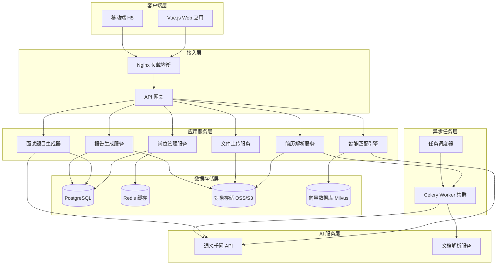
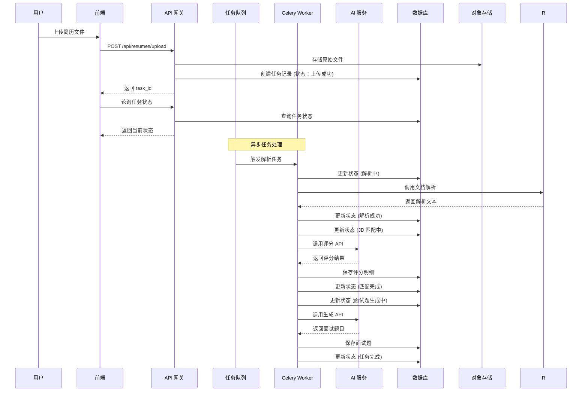
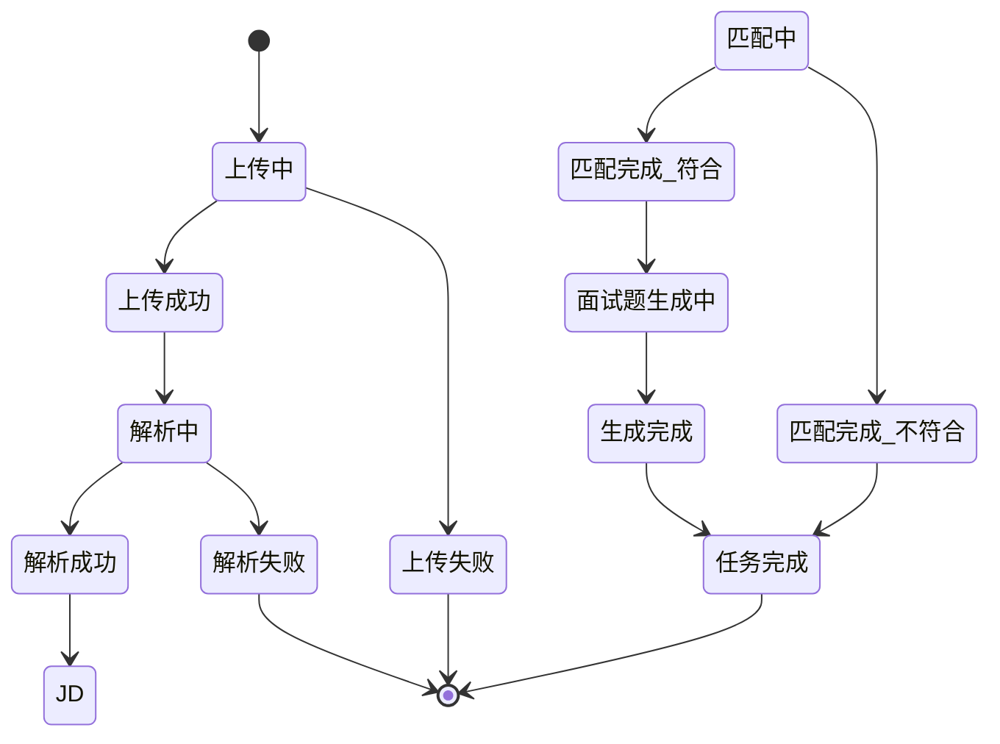

# 人力资源招聘智能辅助工具 - 技术设计方案

需求名称：hr-recruitment-assistant
更新日期：2026-04-21

## 1. 概述

### 1.1 需求背景

本系统设计一个人力资源招聘智能辅助工具，帮助企业 HR 高效处理大量简历筛选工作。系统支持：
- 多岗位 JD（职位描述）管理和评分规则配置
- 多格式简历批量上传和智能解析
- 基于 AI 的简历自动评分和筛选
- 自动生成针对性面试题目和参考答案

### 1.2 设计目标

1. **高效性**：支持批量处理数百份简历，自动化评分和筛选
2. **准确性**：基于 AI 大模型进行智能匹配，评分结果可解释
3. **可追溯性**：完整的任务状态追踪和进度反馈
4. **易用性**：Vue.js 前端提供友好的用户界面和大屏展示
5. **可扩展性**：云端部署，支持水平扩展

### 1.3 技术选型

| 层级 | 技术栈 | 说明 |
|------|--------|------|
| 前端 | Vue 3 + TypeScript + Vite | 现代化前端框架 |
| UI 组件库 | Element Plus | 企业级 UI 组件 |
| 状态管理 | Pinia | Vue 3 推荐的状态管理 |
| 后端 | Python 3.10+ | 快速开发，AI 生态丰富 |
| Web 框架 | FastAPI | 高性能异步 API |
| 数据库 | PostgreSQL 15+ | 关系型数据存储 |
| 对象存储 | 阿里云 OSS / AWS S3 | 文件存储 |
| 向量数据库 | Milvus / Pinecone | 语义相似度检索 |
| AI 服务 | 通义千问 API | 文本理解和生成 |
| 任务队列 | Celery + Redis | 异步任务处理 |
| 部署 | Docker + Kubernetes | 云端容器化部署 |

## 2. 架构

### 2.1 系统架构图



### 2.2 数据流架构



### 2.3 任务状态机



## 3. 组件与接口

### 3.1 前端组件

#### 3.1.1 页面结构

```
src/
├── views/
│   ├── dashboard/              # 数据大屏
│   │   ├── Overview.vue        # 概览统计
│   │   └── StatisticsChart.vue # 统计图表
│   ├── job-posting/            # 岗位管理
│   │   ├── JobList.vue         # 岗位列表
│   │   ├── JobDetail.vue       # 岗位详情
│   │   ├── JobForm.vue         # 岗位创建/编辑
│   │   └── ScoreRuleConfig.vue # 评分规则配置
│   ├── resume/                 # 简历管理
│   │   ├── ResumeList.vue      # 简历列表
│   │   ├── ResumeUpload.vue    # 批量上传
│   │   ├── ResumeDetail.vue    # 简历详情
│   │   └── ParseProgress.vue   # 解析进度
│   ├── matching/               # 匹配筛选
│   │   ├── MatchingResult.vue  # 筛选结果
│   │   ├── ScoreDetail.vue     # 评分明细
│   │   └── AnalysisReport.vue  # 分析报告
│   └── interview/              # 面试管理
│       ├── QuestionList.vue    # 面试题目列表
│       ├── QuestionDetail.vue  # 题目详情
│       └── ExportView.vue      # 导出功能
├── components/
│   ├── FileUpload.vue          # 通用文件上传
│   ├── ProgressTracker.vue     # 进度追踪器
│   ├── StatusTag.vue           # 状态标签
│   └── ReportViewer.vue        # 报告查看器
├── stores/
│   ├── job.ts                  # 岗位状态
│   ├── resume.ts               # 简历状态
│   ├── matching.ts             # 匹配状态
│   └── user.ts                 # 用户状态
└── api/
    ├── job.ts                  # 岗位 API
    ├── resume.ts               # 简历 API
    ├── matching.ts             # 匹配 API
    └── interview.ts            # 面试 API
```

#### 3.1.2 核心 API 接口定义

```typescript
// api/types.ts
interface JobPosting {
  id: string
  title: string
  department: string
  location: string
  jdContent: string
  jdFileUrl?: string
  scoreRules: ScoreRule[]
  status: 'active' | 'closed'
  createdAt: string
  updatedAt: string
}

interface ScoreRule {
  id: string
  dimension: string           // 评分维度：学历、工作经验、技能匹配等
  weight: number              // 权重 0-100
  criteria: ScoreCriteria[]
}

interface ScoreCriteria {
  condition: string           // 条件描述
  score: number               // 得分
}

interface Resume {
  id: string
  jobId: string
  candidateName: string
  originalFileUrl: string
  parsedContent: ParsedResume
  status: TaskStatus
  matchingResult?: MatchingResult
  interviewQuestions?: InterviewQuestion[]
  createdAt: string
}

interface ParsedResume {
  basicInfo: BasicInfo
  education: Education[]
  workExperience: WorkExperience[]
  skills: string[]
  projects?: Project[]
}

interface TaskStatus {
  stage: 'uploading' | 'uploaded' | 'parsing' | 'parsed' | 
         'matching' | 'matched' | 'generating_questions' | 'completed' | 'failed'
  subStage?: string
  progress: number            // 0-100
  message?: string
  error?: string
  timestamps: {
    uploadedAt?: string
    parsedAt?: string
    matchedAt?: string
    questionsGeneratedAt?: string
    completedAt?: string
  }
}

interface MatchingResult {
  totalScore: number
  dimensionScores: DimensionScore[]
  summary: string
  recommendation: 'highly_recommended' | 'recommended' | 'not_recommended'
  analysisReport: string
}

interface DimensionScore {
  dimension: string
  score: number
  maxScore: number
  evidence: string[]
}

interface InterviewQuestion {
  id: string
  question: string
  answer: string
  category: 'technical' | 'behavioral' | 'cultural_fit' | 'problem_solving'
  difficulty: 'easy' | 'medium' | 'hard'
  relatedExperience?: string
}
```

### 3.2 后端服务

#### 3.2.1 项目结构

```
backend/
├── app/
│   ├── __init__.py
│   ├── main.py               # FastAPI 应用入口
│   ├── config.py             # 配置管理
│   ├── dependencies.py       # 依赖注入
│   ├── api/
│   │   ├── v1/
│   │   │   ├── __init__.py
│   │   │   ├── jobs.py       # 岗位管理路由
│   │   │   ├── resumes.py    # 简历管理路由
│   │   │   ├── matching.py   # 匹配筛选路由
│   │   │   ├── interviews.py # 面试题目路由
│   │   │   └── files.py      # 文件上传路由
│   │   └── deps.py           # API 依赖
│   ├── core/
│   │   ├── __init__.py
│   │   ├── security.py       # 安全认证
│   │   ├── exceptions.py     # 异常处理
│   │   └── middleware.py     # 中间件
│   ├── models/
│   │   ├── __init__.py
│   │   ├── job.py            # 岗位模型
│   │   ├── resume.py         # 简历模型
│   │   ├── matching.py       # 匹配结果模型
│   │   └── interview.py      # 面试题目模型
│   ├── schemas/
│   │   ├── __init__.py
│   │   ├── job.py            # 岗位 Schema
│   │   ├── resume.py         # 简历 Schema
│   │   ├── matching.py       # 匹配 Schema
│   │   └── interview.py      # 面试 Schema
│   ├── services/
│   │   ├── __init__.py
│   │   ├── job_service.py    # 岗位业务逻辑
│   │   ├── resume_service.py # 简历业务逻辑
│   │   ├── matching_service.py # 匹配业务逻辑
│   │   ├── interview_service.py # 面试业务逻辑
│   │   └── file_service.py   # 文件业务逻辑
│   ├── tasks/
│   │   ├── __init__.py
│   │   ├── celery_app.py     # Celery 配置
│   │   ├── resume_tasks.py   # 简历处理任务
│   │   ├── matching_tasks.py # 匹配任务
│   │   └── interview_tasks.py # 面试题生成任务
│   ├── integrations/
│   │   ├── __init__.py
│   │   ├── ai_client.py      # AI 服务客户端
│   │   ├── oss_client.py     # 对象存储客户端
│   │   └── vector_db.py      # 向量数据库客户端
│   └── utils/
│       ├── __init__.py
│       ├── parser.py         # 文档解析工具
│       └── exporter.py       # 导出工具 (PDF/Excel)
├── tests/
├── alembic/                  # 数据库迁移
├── requirements.txt
└── Dockerfile
```

#### 3.2.2 核心 API 接口

```python
# app/api/v1/jobs.py
router = APIRouter(prefix="/jobs", tags=["岗位管理"])

@router.post("/", response_model=JobSchema)
async def create_job(job: JobCreateSchema, db: Session = Depends(get_db))

@router.get("/", response_model=List[JobSchema])
async def list_jobs(status: str = None, db: Session = Depends(get_db))

@router.get("/{job_id}", response_model=JobDetailSchema)
async def get_job(job_id: str, db: Session = Depends(get_db))

@router.put("/{job_id}", response_model=JobSchema)
async def update_job(job_id: str, job: JobUpdateSchema, db: Session = Depends(get_db))

@router.delete("/{job_id}")
async def delete_job(job_id: str, db: Session = Depends(get_db))

@router.post("/{job_id}/score-rules")
async def configure_score_rules(job_id: str, rules: ScoreRulesSchema, db: Session = Depends(get_db))

# app/api/v1/resumes.py
router = APIRouter(prefix="/resumes", tags=["简历管理"])

@router.post("/upload", response_model=UploadResponseSchema)
async def upload_resumes(
    files: List[UploadFile],
    job_id: str,
    background_tasks: BackgroundTasks,
    db: Session = Depends(get_db)
)

@router.get("/", response_model=List[ResumeSchema])
async def list_resumes(job_id: str, status: str = None, db: Session = Depends(get_db))

@router.get("/{resume_id}", response_model=ResumeDetailSchema)
async def get_resume(resume_id: str, db: Session = Depends(get_db))

@router.get("/{resume_id}/status")
async def get_resume_status(resume_id: str, db: Session = Depends(get_db))

@router.post("/{resume_id}/retry")
async def retry_resume_processing(resume_id: str, db: Session = Depends(get_db))

# app/api/v1/matching.py
router = APIRouter(prefix="/matching", tags=["匹配筛选"])

@router.get("/results/{job_id}", response_model=List[MatchingResultSchema])
async def get_matching_results(job_id: str, threshold: float = 0.6, db: Session = Depends(get_db))

@router.get("/results/{resume_id}/detail")
async def get_matching_detail(resume_id: str, db: Session = Depends(get_db))

@router.get("/results/{resume_id}/report")
async def get_analysis_report(resume_id: str, db: Session = Depends(get_db))

@router.post("/{job_id}/batch-match")
async def trigger_batch_matching(job_id: str, db: Session = Depends(get_db))

# app/api/v1/interviews.py
router = APIRouter(prefix="/interviews", tags=["面试管理"])

@router.get("/questions/{resume_id}", response_model=List[InterviewQuestionSchema])
async def get_interview_questions(resume_id: str, db: Session = Depends(get_db))

@router.get("/questions/{resume_id}/export")
async def export_interview_questions(resume_id: str, format: str = "pdf", db: Session = Depends(get_db))

@router.post("/questions/{resume_id}/regenerate")
async def regenerate_questions(resume_id: str, db: Session = Depends(get_db))
```

### 3.3 异步任务设计

```python
# app/tasks/resume_tasks.py
@app.task(bind=True, max_retries=3)
def parse_resume_task(self, resume_id: str):
    """简历解析任务"""
    db = SessionLocal()
    try:
        resume = db.query(Resume).get(resume_id)
        update_status(db, resume, TaskStage.PARSING, progress=10)
        
        # 下载文件
        file_path = download_from_oss(resume.original_file_url)
        update_status(db, resume, TaskStage.PARSING, progress=30)
        
        # 文档解析
        parsed_content = parse_document(file_path, resume.file_type)
        update_status(db, resume, TaskStage.PARSED, progress=50, parsed_content=parsed_content)
        
        # 触发匹配任务
        match_resume_task.delay(resume_id)
        
    except Exception as exc:
        update_status(db, resume, TaskStage.FAILED, error=str(exc))
        raise self.retry(exc=exc, countdown=60)
    finally:
        db.close()

@app.task(bind=True, max_retries=3)
def match_resume_task(self, resume_id: str):
    """简历与 JD 匹配评分任务"""
    db = SessionLocal()
    try:
        resume = db.query(Resume).get(resume_id)
        job = db.query(JobPosting).get(resume.job_id)
        update_status(db, resume, TaskStage.MATCHING, progress=60)
        
        # 构建 Prompt
        prompt = build_matching_prompt(job.jd_content, job.score_rules, resume.parsed_content)
        
        # 调用 AI 服务
        ai_client = AIClient()
        matching_result = ai_client.evaluate_resume(prompt)
        update_status(db, resume, TaskStage.MATCHING, progress=80)
        
        # 保存结果
        save_matching_result(db, resume.id, matching_result)
        
        # 判断是否生成面试题
        if matching_result.total_score >= 60:
            update_status(db, resume, TaskStage.MATCHED, progress=90, recommendation="recommended")
            generate_interview_questions_task.delay(resume_id)
        else:
            update_status(db, resume, TaskStage.MATCHED, progress=100, recommendation="not_recommended")
            update_status(db, resume, TaskStage.COMPLETED)
        
    except Exception as exc:
        update_status(db, resume, TaskStage.FAILED, error=str(exc))
        raise self.retry(exc=exc, countdown=60)
    finally:
        db.close()

@app.task(bind=True, max_retries=3)
def generate_interview_questions_task(self, resume_id: str):
    """面试题目生成任务"""
    db = SessionLocal()
    try:
        resume = db.query(Resume).get(resume_id)
        job = db.query(JobPosting).get(resume.job_id)
        matching_result = db.query(MatchingResult).filter_by(resume_id=resume_id).first()
        
        update_status(db, resume, TaskStage.GENERATING_QUESTIONS, progress=92)
        
        # 构建 Prompt
        prompt = build_questions_prompt(job.jd_content, resume.parsed_content, matching_result)
        
        # 调用 AI 服务
        ai_client = AIClient()
        questions = ai_client.generate_interview_questions(prompt, count=15)
        
        # 保存题目
        save_interview_questions(db, resume.id, questions)
        update_status(db, resume, TaskStage.QUESTIONS_GENERATED, progress=98)
        
        update_status(db, resume, TaskStage.COMPLETED, progress=100)
        
    except Exception as exc:
        update_status(db, resume, TaskStage.FAILED, error=str(exc))
        raise self.retry(exc=exc, countdown=60)
    finally:
        db.close()
```

### 3.4 AI 服务集成

```python
# app/integrations/ai_client.py
import dashscope
from typing import List, Dict, Any

class AIClient:
    def __init__(self, api_key: str, model: str = "qwen-max"):
        self.api_key = api_key
        self.model = model
        dashscope.api_key = api_key
    
    def evaluate_resume(self, prompt: str) -> MatchingResult:
        """简历评估评分"""
        try:
            response = dashscope.Generation.call(
                model=self.model,
                prompt=prompt,
                result_format='text',
                temperature=0.3  # 较低温度保证评分稳定性
            )
            
            if response.status_code == 200:
                result_text = response.output.text
                return parse_matching_result(result_text)
            else:
                raise AIServiceError(f"AI 服务调用失败：{response.code}")
                
        except Exception as e:
            raise AIServiceError(f"简历评估失败：{str(e)}")
    
    def generate_interview_questions(self, prompt: str, count: int = 15) -> List[InterviewQuestion]:
        """生成面试题目"""
        try:
            response = dashscope.Generation.call(
                model=self.model,
                prompt=prompt,
                result_format='text',
                temperature=0.7  # 较高温度增加多样性
            )
            
            if response.status_code == 200:
                result_text = response.output.text
                return parse_interview_questions(result_text, count)
            else:
                raise AIServiceError(f"AI 服务调用失败：{response.code}")
                
        except Exception as e:
            raise AIServiceError(f"面试题生成失败：{str(e)}")
    
    def extract_resume_info(self, text: str) -> ParsedResume:
        """从简历文本中提取结构化信息"""
        try:
            prompt = build_extraction_prompt(text)
            response = dashscope.Generation.call(
                model=self.model,
                prompt=prompt,
                result_format='json',
                temperature=0.1
            )
            
            if response.status_code == 200:
                return parse_parsed_resume(response.output.text)
            else:
                raise AIServiceError(f"AI 服务调用失败：{response.code}")
                
        except Exception as e:
            raise AIServiceError(f"简历信息提取失败：{str(e)}")
```

## 4. 数据模型

### 4.1 数据库表结构

```sql
-- 岗位表
CREATE TABLE job_postings (
    id UUID PRIMARY KEY DEFAULT gen_random_uuid(),
    title VARCHAR(200) NOT NULL,
    department VARCHAR(100),
    location VARCHAR(100),
    jd_content TEXT NOT NULL,
    jd_file_url VARCHAR(500),
    status VARCHAR(20) DEFAULT 'active',
    created_by UUID,
    created_at TIMESTAMP WITH TIME ZONE DEFAULT CURRENT_TIMESTAMP,
    updated_at TIMESTAMP WITH TIME ZONE DEFAULT CURRENT_TIMESTAMP
);

-- 评分规则表
CREATE TABLE score_rules (
    id UUID PRIMARY KEY DEFAULT gen_random_uuid(),
    job_id UUID REFERENCES job_postings(id) ON DELETE CASCADE,
    dimension VARCHAR(100) NOT NULL,
    weight INTEGER NOT NULL CHECK (weight >= 0 AND weight <= 100),
    created_at TIMESTAMP WITH TIME ZONE DEFAULT CURRENT_TIMESTAMP
);

-- 评分标准表
CREATE TABLE score_criteria (
    id UUID PRIMARY KEY DEFAULT gen_random_uuid(),
    rule_id UUID REFERENCES score_rules(id) ON DELETE CASCADE,
    condition TEXT NOT NULL,
    score INTEGER NOT NULL,
    sort_order INTEGER DEFAULT 0
);

-- 简历表
CREATE TABLE resumes (
    id UUID PRIMARY KEY DEFAULT gen_random_uuid(),
    job_id UUID REFERENCES job_postings(id) ON DELETE CASCADE,
    candidate_name VARCHAR(100),
    original_file_url VARCHAR(500) NOT NULL,
    file_type VARCHAR(20),
    file_size BIGINT,
    parsed_content JSONB,
    status VARCHAR(50) NOT NULL,
    status_progress INTEGER DEFAULT 0,
    status_message TEXT,
    error_message TEXT,
    uploaded_at TIMESTAMP WITH TIME ZONE,
    parsed_at TIMESTAMP WITH TIME ZONE,
    matched_at TIMESTAMP WITH TIME ZONE,
    questions_generated_at TIMESTAMP WITH TIME ZONE,
    completed_at TIMESTAMP WITH TIME ZONE,
    created_at TIMESTAMP WITH TIME ZONE DEFAULT CURRENT_TIMESTAMP,
    updated_at TIMESTAMP WITH TIME ZONE DEFAULT CURRENT_TIMESTAMP
);

-- 匹配结果表
CREATE TABLE matching_results (
    id UUID PRIMARY KEY DEFAULT gen_random_uuid(),
    resume_id UUID REFERENCES resumes(id) ON DELETE CASCADE,
    total_score DECIMAL(5,2) NOT NULL,
    recommendation VARCHAR(50) NOT NULL,
    summary TEXT,
    analysis_report TEXT,
    created_at TIMESTAMP WITH TIME ZONE DEFAULT CURRENT_TIMESTAMP
);

-- 维度评分表
CREATE TABLE dimension_scores (
    id UUID PRIMARY KEY DEFAULT gen_random_uuid(),
    matching_result_id UUID REFERENCES matching_results(id) ON DELETE CASCADE,
    dimension VARCHAR(100) NOT NULL,
    score DECIMAL(5,2) NOT NULL,
    max_score DECIMAL(5,2) NOT NULL,
    evidence JSONB
);

-- 面试题目表
CREATE TABLE interview_questions (
    id UUID PRIMARY KEY DEFAULT gen_random_uuid(),
    resume_id UUID REFERENCES resumes(id) ON DELETE CASCADE,
    question TEXT NOT NULL,
    answer TEXT NOT NULL,
    category VARCHAR(50) NOT NULL,
    difficulty VARCHAR(20) NOT NULL,
    related_experience TEXT,
    sort_order INTEGER DEFAULT 0,
    created_at TIMESTAMP WITH TIME ZONE DEFAULT CURRENT_TIMESTAMP
);

-- 任务状态追踪表
CREATE TABLE task_status_logs (
    id UUID PRIMARY KEY DEFAULT gen_random_uuid(),
    resume_id UUID REFERENCES resumes(id) ON DELETE CASCADE,
    stage VARCHAR(50) NOT NULL,
    sub_stage VARCHAR(100),
    progress INTEGER NOT NULL,
    message TEXT,
    error TEXT,
    created_at TIMESTAMP WITH TIME ZONE DEFAULT CURRENT_TIMESTAMP
);

-- 索引
CREATE INDEX idx_resumes_job_id ON resumes(job_id);
CREATE INDEX idx_resumes_status ON resumes(status);
CREATE INDEX idx_matching_results_resume_id ON matching_results(resume_id);
CREATE INDEX idx_interview_questions_resume_id ON interview_questions(resume_id);
CREATE INDEX idx_task_status_logs_resume_id ON task_status_logs(resume_id);
CREATE INDEX idx_resumes_parsed_content ON resumes USING GIN(parsed_content);
```

### 4.2 Pydantic Schema

```python
# app/schemas/resume.py
from pydantic import BaseModel, Field
from typing import Optional, List, Dict, Any
from datetime import datetime
from enum import Enum

class TaskStage(str, Enum):
    UPLOADING = "uploading"
    UPLOADED = "uploaded"
    PARSING = "parsing"
    PARSED = "parsed"
    MATCHING = "matching"
    MATCHED = "matched"
    GENERATING_QUESTIONS = "generating_questions"
    QUESTIONS_GENERATED = "questions_generated"
    COMPLETED = "completed"
    FAILED = "failed"

class TaskStatusSchema(BaseModel):
    stage: TaskStage
    sub_stage: Optional[str] = None
    progress: int = Field(ge=0, le=100)
    message: Optional[str] = None
    error: Optional[str] = None
    timestamps: Dict[str, Optional[datetime]] = {
        "uploaded_at": None,
        "parsed_at": None,
        "matched_at": None,
        "questions_generated_at": None,
        "completed_at": None
    }

class ParsedEducationSchema(BaseModel):
    school: str
    degree: str
    major: str
    start_date: Optional[str]
    end_date: Optional[str]

class ParsedWorkExperienceSchema(BaseModel):
    company: str
    position: str
    start_date: Optional[str]
    end_date: Optional[str]
    description: Optional[str]

class ParsedResumeSchema(BaseModel):
    basic_info: Dict[str, Optional[str]]
    education: List[ParsedEducationSchema] = []
    work_experience: List[ParsedWorkExperienceSchema] = []
    skills: List[str] = []
    projects: Optional[List[Dict[str, Any]]] = None

class ResumeSchema(BaseModel):
    id: str
    job_id: str
    candidate_name: Optional[str]
    original_file_url: str
    file_type: str
    file_size: int
    status: TaskStatusSchema
    created_at: datetime
    
    class Config:
        from_attributes = True

class ResumeDetailSchema(ResumeSchema):
    parsed_content: Optional[ParsedResumeSchema] = None
    matching_result: Optional["MatchingResultSchema"] = None
    interview_questions: Optional[List["InterviewQuestionSchema"]] = None

class DimensionScoreSchema(BaseModel):
    dimension: str
    score: float
    max_score: float
    evidence: List[str]

class MatchingResultSchema(BaseModel):
    id: str
    resume_id: str
    total_score: float
    dimension_scores: List[DimensionScoreSchema]
    summary: str
    recommendation: str
    analysis_report: str
    created_at: datetime
    
    class Config:
        from_attributes = True

class InterviewQuestionSchema(BaseModel):
    id: str
    resume_id: str
    question: str
    answer: str
    category: str
    difficulty: str
    related_experience: Optional[str]
    sort_order: int
    created_at: datetime
    
    class Config:
        from_attributes = True
```

## 5. 正确性属性

### 5.1 数据一致性

1. **事务完整性**
   - 所有数据库写操作必须在事务中执行
   - 使用 SQLAlchemy 的 session 管理确保 ACID 特性
   - 关键操作（如状态更新）必须有审计日志

2. **状态一致性**
   - 简历状态转换必须遵循状态机定义
   - 不允许跳过中间状态（如从"上传成功"直接到"匹配完成"）
   - 状态更新必须原子性，避免并发冲突

3. **数据完整性**
   - 外键约束确保关联数据存在
   - 级联删除确保数据 cleanup
   - 必填字段数据库层约束

### 5.2 AI 服务质量保证

1. **评分一致性**
   - 同一份简历多次评估结果差异不超过±5 分
   - 使用温度参数 (temperature=0.3) 控制输出稳定性
   - 对 AI 返回结果进行校验和格式化

2. **超时与重试**
   - AI 服务调用超时设置 60 秒
   - 失败自动重试 3 次，指数退避策略
   - 重试仍失败时标记为失败，支持手动重试

3. **结果校验**
   - 对 AI 返回的 JSON 进行 schema 校验
   - 评分范围校验（0-100）
   - 面试题数量校验（15-20 个）

### 5.3 并发处理

1. **任务队列**
   - 使用 Celery 进行异步任务处理
   - 支持多 Worker 并发处理
   - 任务优先级队列（解析 > 匹配 > 生成面试题）

2. **速率限制**
   - AI API 调用速率限制：10 次/秒
   - 文件上传大小限制：单文件≤20MB
   - 批量上传数量限制：单次≤50 份

3. **资源隔离**
   - 不同岗位的任务独立队列
   - 数据库连接池管理
   - Redis 连接池管理

## 6. 错误处理

### 6.1 异常分类

```python
# app/core/exceptions.py
class AppException(Exception):
    """应用基础异常"""
    def __init__(self, message: str, code: str = None, status_code: int = 500):
        self.message = message
        self.code = code or "INTERNAL_ERROR"
        self.status_code = status_code

class ValidationException(AppException):
    """参数验证异常"""
    def __init__(self, message: str, field: str = None):
        super().__init__(message, "VALIDATION_ERROR", 400)
        self.field = field

class NotFoundException(AppException):
    """资源不存在异常"""
    def __init__(self, resource_type: str, resource_id: str):
        super().__init__(
            f"{resource_type} (ID: {resource_id}) 不存在",
            "NOT_FOUND",
            404
        )

class AIServiceException(AppException):
    """AI 服务异常"""
    def __init__(self, message: str, original_error: str = None):
        super().__init__(f"AI 服务调用失败：{message}", "AI_SERVICE_ERROR", 503)
        self.original_error = original_error

class FileUploadException(AppException):
    """文件上传异常"""
    def __init__(self, message: str, file_name: str = None):
        super().__init__(f"文件上传失败：{message}", "FILE_UPLOAD_ERROR", 500)
        self.file_name = file_name

class ParseException(AppException):
    """文档解析异常"""
    def __init__(self, message: str, file_type: str = None):
        super().__init__(f"文档解析失败：{message}", "PARSE_ERROR", 500)
        self.file_type = file_type
```

### 6.2 全局异常处理

```python
# app/core/middleware.py
@app.exception_handler(AppException)
async def app_exception_handler(request: Request, exc: AppException):
    return JSONResponse(
        status_code=exc.status_code,
        content={
            "error": True,
            "code": exc.code,
            "message": exc.message,
            "details": getattr(exc, "original_error", None)
        }
    )

@app.exception_handler(RequestValidationError)
async def validation_exception_handler(request: Request, exc: RequestValidationError):
    return JSONResponse(
        status_code=400,
        content={
            "error": True,
            "code": "VALIDATION_ERROR",
            "message": "参数验证失败",
            "details": exc.errors()
        }
    )

@app.exception_handler(Exception)
async def global_exception_handler(request: Request, exc: Exception):
    # 记录详细日志
    logger.exception(f"未处理异常：{str(exc)}")
    
    return JSONResponse(
        status_code=500,
        content={
            "error": True,
            "code": "INTERNAL_ERROR",
            "message": "服务器内部错误，请稍后重试"
        }
    )
```

### 6.3 错误恢复策略

| 错误类型 | 恢复策略 |
|---------|---------|
| 文件上传失败 | 清理临时文件，返回错误，支持重新上传 |
| 文档解析失败 | 保留原始文件，记录错误原因，支持手动重试 |
| AI 服务超时 | 自动重试 3 次（1min, 2min, 4min 后） |
| AI 服务返回异常 | 标记任务失败，通知人工介入 |
| 数据库连接失败 | 连接池自动重连，超过阈值报警 |
| 任务队列阻塞 | 监控队列长度，自动扩容 Worker |

## 7. 测试策略

### 7.1 单元测试

```python
# tests/test_matching_service.py
import pytest
from app.services.matching_service import MatchingService
from app.schemas.job import JobSchema
from app.schemas.resume import ParsedResumeSchema

class TestMatchingService:
    
    def test_build_matching_prompt(self):
        """测试匹配 Prompt 构建"""
        job = JobSchema(
            title="高级 Python 工程师",
            jd_content="要求 5 年以上 Python 开发经验...",
            score_rules=[...]
        )
        resume = ParsedResumeSchema(
            basic_info={"name": "张三"},
            education=[...],
            work_experience=[...],
            skills=["Python", "Django", "FastAPI"]
        )
        
        prompt = MatchingService.build_matching_prompt(job, resume)
        
        assert "高级 Python 工程师" in prompt
        assert "5 年以上" in prompt
        assert "Python" in prompt
    
    @pytest.mark.asyncio
    async def test_evaluate_resume_format(self, mock_ai_client):
        """测试评估结果格式校验"""
        mock_ai_client.evaluate_resume.return_value = {
            "total_score": 85,
            "dimension_scores": [...],
            "summary": "...",
            "recommendation": "recommended"
        }
        
        result = await MatchingService.evaluate_resume(
            job_id="test-job",
            resume_id="test-resume",
            ai_client=mock_ai_client
        )
        
        assert 0 <= result.total_score <= 100
        assert result.recommendation in ["highly_recommended", "recommended", "not_recommended"]
```

### 7.2 集成测试

```python
# tests/integration/test_resume_workflow.py
class TestResumeWorkflow:
    
    @pytest.mark.asyncio
    async def test_full_resume_lifecycle(self, client, db_session):
        """测试简历完整生命周期"""
        # 1. 创建岗位
        job_response = await client.post("/api/v1/jobs/", json={
            "title": "测试岗位",
            "jd_content": "测试 JD 内容"
        })
        job_id = job_response.json()["id"]
        
        # 2. 配置评分规则
        await client.post(f"/api/v1/jobs/{job_id}/score-rules", json={
            "rules": [...]
        })
        
        # 3. 上传简历
        with open("tests/fixtures/resume.pdf", "rb") as f:
            upload_response = await client.post(
                "/api/v1/resumes/upload",
                files={"files": f},
                params={"job_id": job_id}
            )
        task_id = upload_response.json()["task_id"]
        
        # 4. 轮询任务状态
        for _ in range(30):  # 最多等待 30 秒
            status_response = await client.get(f"/api/v1/resumes/{task_id}/status")
            status = status_response.json()["stage"]
            
            if status == "completed":
                break
            await asyncio.sleep(1)
        
        assert status == "completed"
        
        # 5. 验证匹配结果
        result_response = await client.get(f"/api/v1/matching/results/{task_id}/detail")
        assert result_response.status_code == 200
        result = result_response.json()
        assert "total_score" in result
        
        # 6. 验证面试题目
        questions_response = await client.get(f"/api/v1/interviews/questions/{task_id}")
        assert questions_response.status_code == 200
        questions = questions_response.json()
        assert 15 <= len(questions) <= 20
```

### 7.3 AI 质量评估

1. **人工审核机制**
   - 随机抽样 10% 的评估结果进行人工审核
   - 建立评分标准一致性校验集（100 份标注简历）
   - 定期对比 AI 评分与人工评分的差异

2. **A/B 测试**
   - 不同 Prompt 版本的评分效果对比
   - 不同 AI 模型的准确率对比
   - 收集 HR 用户反馈持续优化

3. **质量指标**
   - 评分准确率目标：≥85%（与人工评分对比）
   - 面试题相关性评分：≥4.0/5.0（用户打分）
   - 系统可用性：≥99.5%

## 8. 部署架构

### 8.1 容器化部署

```yaml
# docker-compose.yml
version: '3.8'

services:
  frontend:
    build: ./frontend
    ports:
      - "80:80"
    depends_on:
      - backend
  
  backend:
    build: ./backend
    environment:
      - DATABASE_URL=postgresql://user:pass@db:5432/hr_recruitment
      - REDIS_URL=redis://redis:6379
      - AI_API_KEY=${AI_API_KEY}
      - OSS_ENDPOINT=${OSS_ENDPOINT}
    depends_on:
      - db
      - redis
  
  celery_worker:
    build: ./backend
    command: celery -A app.tasks.celery_app worker --loglevel=info
    environment:
      - DATABASE_URL=postgresql://user:pass@db:5432/hr_recruitment
      - REDIS_URL=redis://redis:6379
      - AI_API_KEY=${AI_API_KEY}
    depends_on:
      - db
      - redis
    deploy:
      replicas: 3
  
  celery_beat:
    build: ./backend
    command: celery -A app.tasks.celery_app beat --loglevel=info
    depends_on:
      - redis
  
  db:
    image: postgres:15-alpine
    volumes:
      - postgres_data:/var/lib/postgresql/data
    environment:
      - POSTGRES_USER=user
      - POSTGRES_PASSWORD=pass
      - POSTGRES_DB=hr_recruitment
  
  redis:
    image: redis:7-alpine
    volumes:
      - redis_data:/data
  
  nginx:
    image: nginx:alpine
    volumes:
      - ./nginx.conf:/etc/nginx/nginx.conf
    ports:
      - "443:443"
    depends_on:
      - frontend
      - backend

volumes:
  postgres_data:
  redis_data:
```

### 8.2 Kubernetes 部署

```yaml
# k8s/backend-deployment.yaml
apiVersion: apps/v1
kind: Deployment
metadata:
  name: hr-recruitment-backend
spec:
  replicas: 3
  selector:
    matchLabels:
      app: backend
  template:
    metadata:
      labels:
        app: backend
    spec:
      containers:
      - name: backend
        image: hr-recruitment-backend:latest
        env:
        - name: DATABASE_URL
          valueFrom:
            secretKeyRef:
              name: db-secret
              key: url
        - name: AI_API_KEY
          valueFrom:
            secretKeyRef:
              name: ai-secret
              key: api-key
        resources:
          requests:
            memory: "512Mi"
            cpu: "250m"
          limits:
            memory: "1Gi"
            cpu: "500m"
        livenessProbe:
          httpGet:
            path: /health
            port: 8000
          initialDelaySeconds: 30
          periodSeconds: 10
        readinessProbe:
          httpGet:
            path: /ready
            port: 8000
          initialDelaySeconds: 10
          periodSeconds: 5
---
apiVersion: v1
kind: Service
metadata:
  name: backend-service
spec:
  selector:
    app: backend
  ports:
  - port: 8000
    targetPort: 8000
  type: ClusterIP
```

### 8.3 监控与告警

```yaml
# prometheus 监控配置
scrape_configs:
  - job_name: 'backend'
    static_configs:
      - targets: ['backend-service:8000']
    metrics_path: '/metrics'
  
  - job_name: 'celery'
    static_configs:
      - targets: ['celery-worker:5555']

# 告警规则
groups:
- name: hr_recruitment_alerts
  rules:
  - alert: HighTaskFailureRate
    expr: rate(task_failures_total[5m]) > 0.1
    for: 5m
    annotations:
      summary: "任务失败率过高"
  
  - alert: AIServiceLatency
    expr: histogram_quantile(0.95, rate(ai_request_duration_seconds_bucket[5m])) > 30
    for: 5m
    annotations:
      summary: "AI 服务延迟过高"
  
  - alert: DatabaseConnectionsHigh
    expr: pg_stat_activity_count > 80
    for: 5m
    annotations:
      summary: "数据库连接数过高"
```

## 9. 安全与合规

### 9.1 数据安全

1. **敏感信息脱敏**
   - 候选人姓名、电话、邮箱在日志中脱敏
   - 数据库加密存储敏感字段
   - 文件存储使用加密传输（HTTPS）

2. **访问控制**
   - JWT Token 认证
   - RBAC 权限模型（管理员/HRE/普通用户）
   - API 请求频率限制

3. **审计日志**
   - 记录所有数据访问操作
   - 记录用户操作日志
   - 日志保留至少 180 天

### 9.2 合规性

1. **个人信息保护**
   - 符合《个人信息保护法》要求
   - 简历数据加密存储
   - 支持数据导出和删除请求

2. **数据留存策略**
   - 简历数据默认保留 2 年
   - 支持自动归档和清理
   - 提供数据备份和恢复机制

## 10. 性能优化

### 10.1 数据库优化

```sql
-- 物化视图加速统计查询
CREATE MATERIALIZED VIEW mv_job_statistics AS
SELECT 
    job_id,
    COUNT(*) as total_resumes,
    COUNT(CASE WHEN status = 'completed' THEN 1 END) as completed_resumes,
    AVG((matching_result->>'total_score')::numeric) as avg_score,
    COUNT(CASE WHEN (matching_result->>'recommendation') = 'recommended' THEN 1 END) as recommended_count
FROM resumes
LEFT JOIN matching_results ON resumes.id = matching_results.resume_id
GROUP BY job_id;

-- 定时刷新
REFRESH MATERIALIZED VIEW CONCURRENTLY mv_job_statistics;
```

### 10.2 缓存策略

```python
# Redis 缓存键设计
CACHE_KEYS = {
    "job_detail": "job:{job_id}:detail",           # TTL: 5 分钟
    "job_statistics": "job:{job_id}:stats",        # TTL: 1 分钟
    "resume_status": "resume:{resume_id}:status",  # TTL: 10 分钟
    "matching_result": "matching:{resume_id}:result", # TTL: 30 分钟
    "interview_questions": "interview:{resume_id}:questions" # TTL: 1 小时
}

# 缓存装饰器
from functools import wraps
import json

def cache_result(key_pattern: str, ttl: int = 300):
    def decorator(func):
        @wraps(func)
        async def wrapper(*args, **kwargs):
            # 构建缓存键
            cache_key = key_pattern.format(**kwargs)
            
            # 尝试从缓存获取
            cached = await redis.get(cache_key)
            if cached:
                return json.loads(cached)
            
            # 执行函数
            result = await func(*args, **kwargs)
            
            # 写入缓存
            await redis.setex(cache_key, ttl, json.dumps(result))
            return result
        return wrapper
    return decorator
```

### 10.3 前端性能

1. **按需加载**
   - 路由级代码分割
   - 组件懒加载
   - 图片懒加载

2. **数据优化**
   - 分页加载（每页 20 条）
   - 虚拟滚动（大屏展示）
   - 增量更新（WebSocket 推送状态）

3. **构建优化**
   - Tree Shaking 移除无用代码
   - Gzip 压缩
   - CDN 静态资源加速

## 11. 项目里程碑

| 阶段 | 时间 | 交付物 |
|------|------|--------|
| 第一阶段 | 第 1-2 周 | 项目脚手架、数据库设计、基础设施搭建 |
| 第二阶段 | 第 3-4 周 | 岗位管理模块、文件上传服务 |
| 第三阶段 | 第 5-6 周 | 简历解析服务、AI 集成 |
| 第四阶段 | 第 7-8 周 | 智能匹配引擎、评分系统 |
| 第五阶段 | 第 9-10 周 | 面试题目生成、报告导出 |
| 第六阶段 | 第 11-12 周 | 前端大屏、测试优化、上线部署 |

---

## 引用链接

[^1]: [FastAPI 官方文档](https://fastapi.tiangolo.com/)
[^2]: [Vue 3 官方文档](https://vuejs.org/)
[^3]: [Celery 官方文档](https://docs.celeryq.dev/)
[^4]: [通义千问 API 文档](https://help.aliyun.com/zh/dashscope/)
